# 一、认识HTML 

## **1、超文本标记语言**

* （英语：**H**yper**T**ext **M**arkup **L**anguage，简称：**HTML**）是一种用于创建网页的标准标记语言。

* HTML元素是构建网站的基石；

### **（1）什么是标记语言（**markup language ）？

* 由无数个标记（标签、tag)组成；

* 是对某些内容进行特殊的标记，以供其他解释器识别处理；

*  比如使用`<h2></h2>`标记的文本会被识别为“标题”进行加粗、文字放大显示；

*  由标签和内容组成的称为元素（element）


### **（2）什么是超文本（ HyperText ）呢？**

* 表示不仅仅可以插入普通的文本（Text），还可以插入图片、音频、视频等内容；

* 还可以表示超链接（HyperLink），从一个网页跳转到另一个网页；


### **（3）HTML文件的拓展名是.htm\.html**

* 因历史遗留问题，Win95\Win98系统的文件拓展名不能超过3字符，所以使用.htm

* 现在统一使用 .html

```html
<html>
  <head>
    <title>我的网页</title>
  </head>
  <body>
    <h1>HelloWorld</h1>
    <div>zkyaaa</div>
    
  </body>
</html>>
```


## 2、VSCode

### **（1）VSCode编辑器下载-安装**

​			https://code.visualstudio.com/

###  **（2）安装插件（增加功能）**

右侧图标最后一项，Extensions，查找需要的插件（联网）

* 中文插件：Chinese

* 颜色主题：atom one dark

* 文件夹图标：VSCode Great Icons

* 在浏览器中打开网页：open in browser、Live Sever

* 自动重命名标签：auto rename tag

### **（3）VSCode的配置：**

* Auto Save 自动保存

* Font Size 修改代码字体大小

* Word Wrap 代码自动换行: on 

* Render Whitespace 空格的渲染方式(个人推荐)：all

* Tab Size 代码缩进
  * **推荐2个空格**（公司开发项目基本都是2个空格）
  * vscode缩进的时候按住tab，向前缩进shift+tab
  * control + enter 回车
  * VScode按!+回车自动生成HTML模板
  * alt+shift+向下箭头   向下复制


## **3、认识元素**

### （1）元素

我们会发现HTML本质上是由一系列的**元素（Element）**构成的；

* **什么是元素（Element）呢？**
  * 元素是网页的一部分；
  * 一个元素可以包含一个数据项，或是一块文本，或是一张照片，亦或是什么也不包含；

*  **那么HTML有哪些元素呢？**
  *  https://developer.mozilla.org/zh-CN/docs/Web/HTML/Element

* **我们会发现元素非常非常的多，这么多能记得住吗？**
  *  常用的，用的多自然就记住了；
  * 不常用的，知道在哪里查找即可

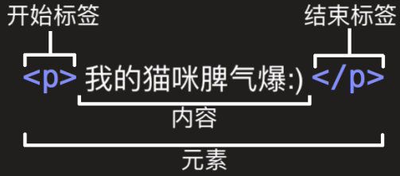


### （2）元素的组成

* **开始标签**（Opening tag）：包含元素的名称（本例为 p），被左、右尖括号所包围。表示元素从这里开始或者开始起作用 ——

  * 在本例中即段落由此开始。

* **结束标签**（Closing tag）：与开始标签相似，只是其在元素名之前包含了一个斜杠。这表示着元素的结尾 —— 在本例中即段落

在此结束。初学者常常会犯忘记包含结束标签的错误，这可能会产生一些奇怪的结果。

*  **内容**（Content）：元素的内容，本例中就是所输入的文本本身。

* **元素**（Element）：开始标签、结束标签与内容相结合，便是一个完整的元素


### （3）**单标签元素 – 双标签元素**

* **双标签元素**：我们会发现前面大部分看到的元素都是双标签的；

   html、body、head、h2、p、a元素；

* **单标签元素**：也有一些元素是只有一个标签；

   br、img、hr、meta、input；

```html
<!DOCTYPE html>
<html lang="en">
<head>
  <meta charset="UTF-8">
  <meta http-equiv="X-UA-Compatible" content="IE=edge">
  <meta name="viewport" content="width=device-width, initial-scale=1.0">
  <title>Document</title>
</head>
<body>
  <!-- 1.双标签元素 -->
  <p>我是段落</p>
  <p>
    <span></span>
  </p>

  <!-- 2.单标签 -->
  
  
  
  <input type="text">
</body>
</html>
```


### （4）**元素的属性**

* **元素也可以拥有属性（**Attribute）：

* 属性包含元素的额外信息，这些信息不会出现在实际的内容中。

* **一个属性必须包含如下内容：**
  * 一个空格，在属性和元素名称之间。(如果已经有一个或多个属性，就与前一个属性之间有一个空格。)
  * 属性名称，后面跟着一个等于号。
  * 一个属性值，由一对引号“ ”引起来。

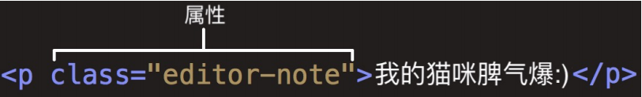

* **元素属性分类**

  * **有些属性是公共的**，每一个元素都可以设置

    ​	比如class、id、title属性

  * **有些属性是元素特有的**，不是每一个元素都可以设置

    ​	比如meta元素的charset属性、img元素的alt属性等

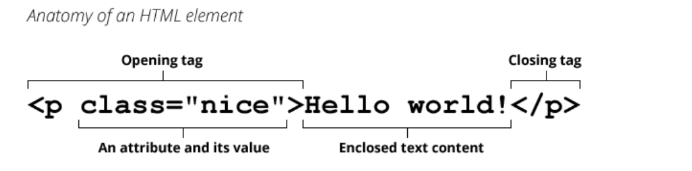

* **元素的嵌套**


# 二、HTML常见的元素

## 1、HTML结构分析

### （1）文档声明

* HTML最上方的一段文本我们称之为 **文档类型声明**，用于声明**文档类型**

```html
<!DOCTYPE html>
```


* **!DOCTYPE html>**
  * HTML文档声明，告诉浏览器当前页面是HTML5页面；
  * 让浏览器用HTML5的标准去解析识别内容；
  * 必须放在HTML文档的最前面，不能省略，省略了会出现兼容性问题；


* HTML5的文档声明比HTML 4.01、XHTML 1.0简洁非常多(了解即可)

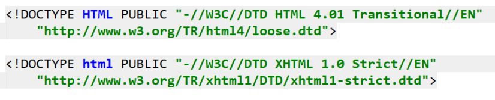


### （2）html元素（小写html）

* **<html>** 元素 表示一个 HTML 文档的**根**（顶级元素），所以它也被称为**根元素**。

  * 所有其他元素必须是此元素的后代。

  

* W3C标准建议为html元素增加一个**lang属性**，作用是

  * 帮助语音合成工具确定要使用的发音;
  * 帮助翻译工具确定要使用的翻译规则;
    

* **比如常用的规则：**
  * lang=“en”表示这个HTML文档的语言是英文；
  * lang=“zh-CN”表示这个HTML文档的语言是中文；zh-CN表示简体中文


* **head元素**

  * **HTML head** **元素** 规定文档相关的**配置信息（也称之为元数据），**包括文档的标题，引用的文档样式和脚本等。

    * 什么是元数据（meta data），是描述数据的数据；
    * 这里我们可以理解成对整个页面的配置

  * **常见的设置有哪些呢？一般会至少包含如下2个设置。**

    * 网页的标题：title元素

    * 网页的编码：meta元素

      * 可以用于设置网页的字符编码，让浏览器更精准地显示每一个文字，不设置或者设置错误会导致乱码；
      * 一般都使用utf-8编码，涵盖了世界上几乎所有的文字；

      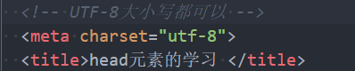

* **body元素**

  * body元素里面的内容将是你**在浏览器窗口中看到的东西**，也就是**网页的具体内容和结构**。


### （3）**HTML元素**

* HTML元素本身很多，但是**常用的元素就是那么几个**。

  * https://developer.mozilla.org/zh-CN/docs/Web/HTML/Element

  *  我们只需要记住常用的，不常用的学会查看文档即可；

  

* **常用的元素**

  *  p元素、h元素；

  *  img元素、a元素、iframe元素；

  *  div元素、span元素；


## 2、h1~h6、p元素

### （1）h1~h6

* 在一个页面中通常会有一些**比较**重要的文字作为标题**，这个时候我们可以使用**h元素。
* **<h1>–<h6> 标题 (Heading) 元素**呈现了六个不同的级别的标题
  * Heading是头部的意思，通常会用来做标题
  * 注意：**h元素通常和SEO优化有关系**

```html
<!DOCTYPE html>
<html lang="en">
<head>
  <meta charset="UTF-8">
  <meta http-equiv="X-UA-Compatible" content="IE=edge">
  <meta name="viewport" content="width=device-width, initial-scale=1.0">
  <title>Document</title>
</head>
<body>
  <h1>我是h1标题</h1>
  <h2>我是h2标题</h2>
  <h3>我是h3标题</h3>
  <h4>我是h4标题</h4>
  <h5>我是h5标题</h5>
  <h6>我是h6标题</h6>
</body>
</html>
```


### （2）p元素

* 如果我们想**表示一个段落**，这个时候可以使用p元素。
* **HTML <p>**元素（或者说 HTML 段落元素）表示**文本的一个段落**。
  * p元素是paragraph单词的缩写，是段落、分段的意思；
  * p元素多个段落之间会有一定的间距

```html
<!DOCTYPE html>
<html lang="en">
<head>
  <meta charset="UTF-8">
  <meta http-equiv="X-UA-Compatible" content="IE=edge">
  <meta name="viewport" content="width=device-width, initial-scale=1.0">
  <title>Document</title>
</head>
<body>
  <p> 
    最后一个是国王，他是小王子在离开自己的星球后拜访的第一个小星球325上仅有的居民。这个国王称自己统治所有一切，他的统治必须被尊敬和不容忤逆;然而，事实上他只是徒有虚名，他只能让别人去做别人自己想做的事。
  </p>
  <P>
    这些都是光遇里的小王子季节留下的一个独立的小星球，这里包括了小王子遇到的很多人，每个人都是独立的一个小星球，虽然小王子遇到他们虽然不理解，但是他们都是独立的人格，每个人都是自己独立的星球。
  </P>
</body>
</html>
```


## 3、img、a元素

### （1）img元素

* HTML  元素将一份图像嵌入文档。
  * img是image单词的所以，是图像、图像的意思
  * 事实上img是一个可替换元素（ replaced element ）；

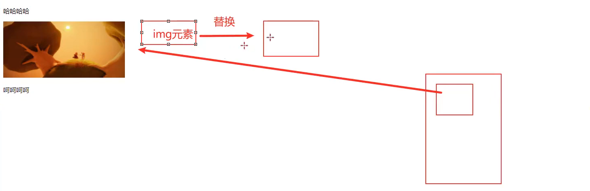

* img有两个常见的属性：
  * src属性：source单词的缩写，表示源
    * 是**必须的**，它包含了你想嵌入的图片的文件路径。
  * alt属性：不是强制性的，有两个作用
    * 作用一：当图片加载不成功（错误的地址或者图片资源不存在），那么会显示这段文本；
    * 作用二：屏幕阅读器会将这些描述读给需要使用阅读器的使用者听，让他们知道图像的含义；
  * **某些其他属性目前已经不再使用**:比如width、height、border,后面主要使用css


* **设置img的src时，需要给图片设置路径：**

  * 网络图片：一个URL地址（后续会专门讲URL）；
    *  网络图片的设置非常简单，给一个地址即可；

  * 本地图片：本地电脑上的图片，后续会和html一起部署到服务；

  

* **本地图片的路径有两种方式：**

  * 方式一：绝对路径（几乎不用）；
    * 从电脑的根目录开始一直找到资源的路径；
  * 方式二：相对路径（常用）；
    * 相当于当前文件的一个路径；
    * . 代表当前文件夹（1个.），可以省略
    * .. 代表上级文件夹（2个.）

* 对于网页来说，不管什么操作系统（Windows、Mac、Linux），路径分隔符都是 /，而不是 \

```html
<!DOCTYPE html>
<html lang="en">
<head>
  <meta charset="UTF-8">
  <meta http-equiv="X-UA-Compatible" content="IE=edge">
  <meta name="viewport" content="width=device-width, initial-scale=1.0">
  <title>Document</title>
</head>
<body>
  
  <div class="box">fdafdas</div>
  
  <!-- 
    src:
      1.网络图片
      2.
   -->
  <!--  -->

  <!-- 本地图片
    图片的路径: 
      1> 绝对(absolute)路径: 根盘符开始查找, 一直找到这个资源
      2> 相对(relative)路径: bx
  -->
  <!--  -->
  
</body>
</html>
```

* **img元素支持的图片格式非常多**

  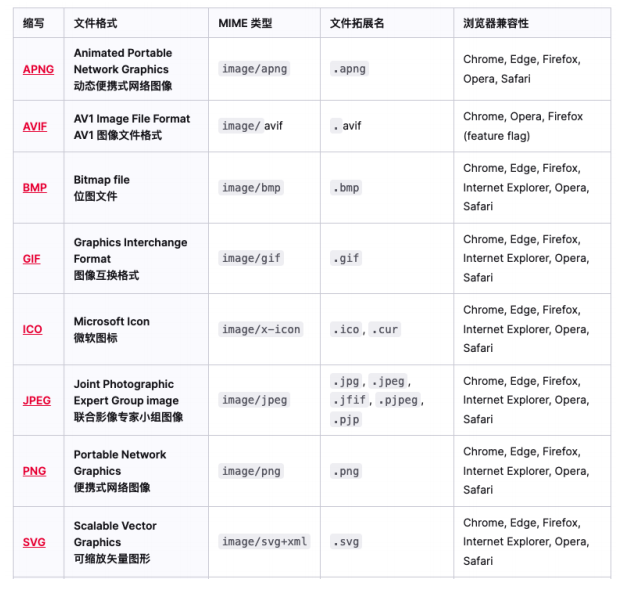


### （2）a元素

* 在网页中我们经常需要**跳转到另外一个链接**，这个时候我们使用**a元素**；
* **HTML <a> 元素**（或称锚（anchor）元素）：
  * 定义超链接，用于打开新的URL；
* **a元素有两个常见的属性：**
  * href：Hypertext Reference的简称
    * 指定要打开的URL地址；
    * 也可以是一个本地地址；
  * target：该属性指定在何处显示链接的资源。
    * _self：默认值，在当前窗
    * _blank：在一个新的窗口中打开URL；
    * 其他不常用, 后面iframe可以讲一下；

```html
<!DOCTYPE html>
<html lang="en">
<head>
  <meta charset="UTF-8">
  <meta http-equiv="X-UA-Compatible" content="IE=edge">
  <meta name="viewport" content="width=device-width, initial-scale=1.0">
  <title>Document</title>
</head>
<body>
  <!-- blank：空白资源 -->
  <!-- http://wwww.baidu.com ->服务器 ->html -->
  <a href="http://wwww.baidu.com" target="_self">百度一下</a>
  <a href="http://wwww.baidu.com" target="_blank">百度一下</a>

  <!-- 链接到本地的网页（本地资源地址） -->
  <a href="./09_img元素中的图片路径.html" target="_parent">本地资源</a>
</body>
</html>
```

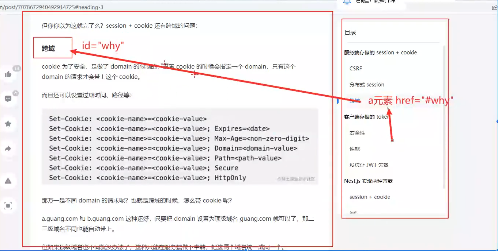

* 锚点链接可以实现：跳转到**网页中的具体位置**
* **锚点链接有两个重要步骤**
  * 在要跳到的元素上定义一个id属性；
  * 定义a元素，并且a元素的href指向对应的id；

```html
<!DOCTYPE html>
<html lang="en">
<head>
  <meta charset="UTF-8">
  <meta http-equiv="X-UA-Compatible" content="IE=edge">
  <meta name="viewport" content="width=device-width, initial-scale=1.0">
  <title>Document</title>
</head>
<body>
   <!-- 
    页面内的锚点效果
    1. 在跳转到的元素上添加id
    2. 定义a元素, 并且a元素的href属性指向id
   -->
   <a href="#theme01">跳转到主题一</a>
   <a href="#theme02">跳转到主题二</a>
   <a href="#theme03">跳转到主题三</a>

  <h2 id="theme01">主题一</h2>
  <p>
    我是coderwhy <br> 哈哈哈哈哈哈
    <br><br><br><br><br><br><br><br><br><br><br><br><br><br><br><br><br><br><br><br><br><br><br><br><br>
    <br><br><br><br><br><br><br><br><br><br><br><br><br><br><br><br><br><br><br><br><br><br><br><br><br>
    <br><br><br><br><br><br><br><br><br><br><br><br><br><br><br><br><br><br><br><br><br><br><br><br><br>
    <br><br><br><br><br><br><br><br><br><br><br><br><br><br><br><br><br><br><br><br><br><br><br><br><br>
    <br><br><br><br><br><br><br><br><br><br><br><br><br><br><br><br><br><br><br><br><br><br><br><br><br>
    <br><br><br><br><br><br><br><br><br><br><br><br><br><br><br><br><br><br><br><br><br><br><br><br><br>
    <br><br><br><br><br><br><br><br><br><br><br><br><br><br><br><br><br><br><br><br><br><br><br><br><br>
    <br><br><br><br><br><br><br><br><br><br><br><br><br><br><br><br><br><br><br><br><br><br><br><br><br>
  </p>
  <h2 id="theme02">主题二</h2>
  <p>
    <br><br><br><br><br><br><br><br><br><br><br><br><br><br><br><br><br><br><br><br><br><br><br><br><br>
    <br><br><br><br><br><br><br><br><br><br><br><br><br><br><br><br><br><br><br><br><br><br><br><br><br>
    <br><br><br><br><br><br><br><br><br><br><br><br><br><br><br><br><br><br><br><br><br><br><br><br><br>
    <br><br><br><br><br><br><br><br><br><br><br><br><br><br><br><br><br><br><br><br><br><br><br><br><br>
    <br><br><br><br><br><br><br><br><br><br><br><br><br><br><br><br><br><br><br><br><br><br><br><br><br>
    <br><br><br><br><br><br><br><br><br><br><br><br><br><br><br><br><br><br><br><br><br><br><br><br><br>
    <br><br><br><br><br><br><br><br><br><br><br><br><br><br><br><br><br><br><br><br><br><br><br><br><br>
    <br><br><br><br><br><br><br><br><br><br><br><br><br><br><br><br><br><br><br><br><br><br><br><br><br>
  </p>
  <h2 id="theme03">主题三</h2>
  <p>
    <br><br><br><br><br><br><br><br><br><br><br><br><br><br><br><br><br><br><br><br><br><br><br><br><br>
    <br><br><br><br><br><br><br><br><br><br><br><br><br><br><br><br><br><br><br><br><br><br><br><br><br>
    <br><br><br><br><br><br><br><br><br><br><br><br><br><br><br><br><br><br><br><br><br><br><br><br><br>
    <br><br><br><br><br><br><br><br><br><br><br><br><br><br><br><br><br><br><br><br><br><br><br><br><br>
    <br><br><br><br><br><br><br><br><br><br><br><br><br><br><br><br><br><br><br><br><br><br><br><br><br>
    <br><br><br><br><br><br><br><br><br><br><br><br><br><br><br><br><br><br><br><br><br><br><br><br><br>
    <br><br><br><br><br><br><br><br><br><br><br><br><br><br><br><br><br><br><br><br><br><br><br><br><br>
    <br><br><br><br><br><br><br><br><br><br><br><br><br><br><br><br><br><br><br><br><br><br><br><br><br>
  </p>
</body>
</html>
```


* 在很多网站我们会发现图片也是可以点击进行跳转的
  * img元素跟a元素一起使用，可以实现图片链接；
  * **实现思路：**
    * a元素中不存放文字，而是存放一个img元素；
    * 也就是img元素是a元素的内容；

```html
<!DOCTYPE html>
<html lang="en">
<head>
  <meta charset="UTF-8">
  <meta http-equiv="X-UA-Compatible" content="IE=edge">
  <meta name="viewport" content="width=device-width, initial-scale=1.0">
  <title>Document</title>
</head>
<body>
  <a href="https://www.mi.com/redmik50" target="_blank">
    
  </a>
</body>
</html>
```


* **a元素 – 其他URL地址**

```html
<!DOCTYPE html>
<html lang="en">
<head>
  <meta charset="UTF-8">
  <meta http-equiv="X-UA-Compatible" content="IE=edge">
  <meta name="viewport" content="width=device-width, initial-scale=1.0">
  <title>Document</title>
</head>
<body>
  <!-- 指向链接: zip压缩包 -->
  <a href="https://github.com/coderwhy/HYMiniMall/archive/master.zip">下载zip包</a>

  <!-- 指向其他协议地址: mailto -->
  <a href="mailto:905407438@qq.com">发邮件给123@qq.com</a>
</body>
</html>
```


## 5、iframe元素

### （1）iframe元素

* 利用iframe元素可以实现：在一个HTML文档中嵌入其他HTML文档

  * frameborder属性

  * 用于规定是否显示边框

    * 1：显示
    * 0：不显示

    

  * a元素target的其他值:
  * _parent：在父窗口中打开URL
    
    * _top：在顶层窗口中打开URL

* X-Frame-Options : sameorigin 修改不给iframe嵌套

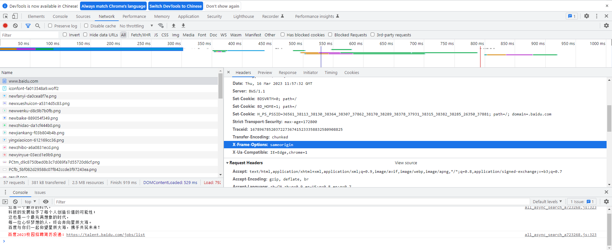


## 6、div和span元素

### （1）历史

* 在HTML中**有两个特殊的元素div元素、span元素**：
  * div元素：division，分开、分配的意思；
  * span元素：跨域、涵盖的意思；
* **两个元素有什么作用呢？**无所用、无所不用。
* **产生的历史：**
  * 网页的发展早期是没有css，这个时候我们必须通过语义化元素来告知浏览器一段文字如何显示；
  * 后来出现了css，结构和样式需要分离，这个时候html只需要负责结构即可；
  * 比如h1元素可以是一段普通的文本+CSS修饰样式；
  * 这个时候就出现了div、span来编写HTML结构所有的结构，样式都交给css来处理；
* **所以，理论上来说：**
  * 我们的页面可以没有div、span；
  * 我们的页面也可以全部都是div、span；

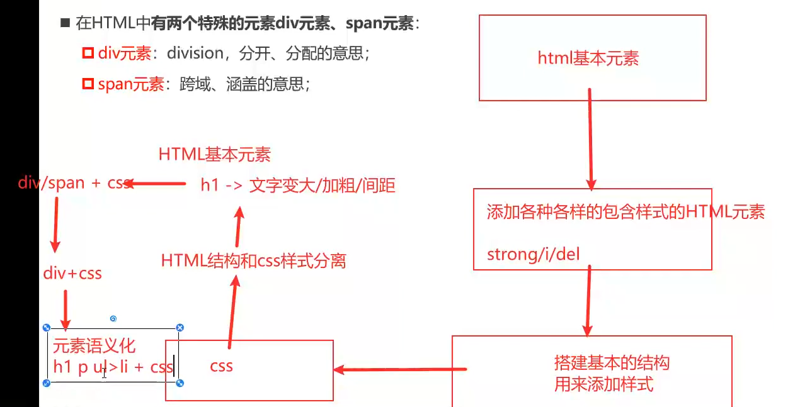

### （2）区别

* div元素和span元素都是**“纯粹的” 容器**，也可以把他们理解成**“盒子”**，它们都是用来**包裹内容**的；
* **div元素：**多个div元素包裹的内容会在不同的行显示；
  * 一般作为其他元素的父容器，把其他元素包住，代表一个整体
  * 用于把网页分割为多个独立的部分
* **span元素：**多个span元素包裹的内容会在同一行显示
  * 默认情况下，跟普通文本几乎没差别
  * 用于区分特殊文本和普通文本，比如用来显示一些关键字

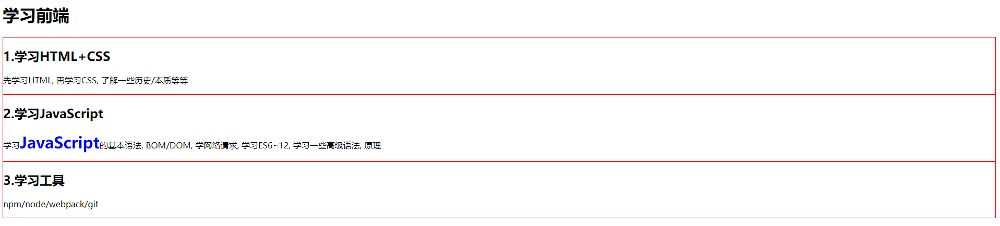

```html
<!DOCTYPE html>
<html lang="en">
<head>
  <meta charset="UTF-8">
  <meta http-equiv="X-UA-Compatible" content="IE=edge">
  <meta name="viewport" content="width=device-width, initial-scale=1.0">
  <title>Document</title>
  <style>
    .area {
      border: 1px solid red;
    }

    .keyword {
      font-size: 30px;
      font-weight: 700;
      color: blue;
    }
  </style>
</head>
<body>
  
  <h1>学习前端</h1>
  <div class="area">
    <h2>1.学习HTML+CSS</h2>
    <p>
      先学习HTML, 再学习CSS, 了解一些历史/本质等等
    </p>
  </div>
    
  <div class="area">
    <h2>2.学习JavaScript</h2>
    <p>
      学习<span class="keyword">JavaScript</span>的基本语法, BOM/DOM, 学网络请求, 学习ES6~12, 学习一些高级语法, 原理
    </p>
  </div>

  <div class="area">
    <h2>3.学习工具</h2>
    <p>
      npm/node/webpack/git
    </p>
  </div>

</body>
</html>
```


## 7、不常用元素

* **strong元素**：内容加粗、强调；
  * 通常加粗会使用css样式来完成；
  * 开发中很偶尔会使用一下；
* **i元素：**内容倾斜；
  * 通常斜体会使用css样式来完成
  * 开发中偶尔会用它来做字体图标（因为看起来像是icon的缩写）；
* **code元素：**用于显示代码
  * 偶尔会使用用来显示等宽字体
* **br元素：**换行元素
  * 开发中已经不使用；
* 更多元素详解，查看MDN文档：
  * https://developer.mozilla.org/zh-CN/docs/Web/HTML/Element


## 8、HTML全局属性

* **某些属性只能设置在特定的元素**中：
  * 比如img元素的src、a元素的href；
* **有一些属性是所有HTML都可以设置和拥有**的，这样的属性我们称之为 **“全局属性（Global Attributes）”**
  *  全局属性有很多：https://developer.mozilla.org/zh-CN/docs/Web/HTML/Global_attributes
* **常见的全局属性如下：**
  * id：定义唯一标识符（ID），该标识符在整个文档中必须是唯一的。其目的是在链接（使用片段标识符），脚本或样式（使用 CSS）时标识元素
  * class：一个以空格分隔的元素的类名（classes ）列表，它允许 CSS 和 Javascript 通过类选择器或者DOM方法来选择和访问特定的元素；
  * style：给元素添加内联样式；
  * title：包含表示与其所属元素相关信息的文本。 这些信息通常可以作为提示呈现给用户，但不是必须的。


# 三、额外知识点补充

## 1、字符实体

* HTML 实体是一段以连字号（&）开头、以分号（;）结尾的文本（字符串）：
  * 实体常常用于显示保留字符（这些字符会被解析为 HTML 代码）和不可见的字符（如“不换行空格”）；
  * 你也可以用实体来代替其他难以用标准键盘键入的字符；
* **常见的字符实体**
* 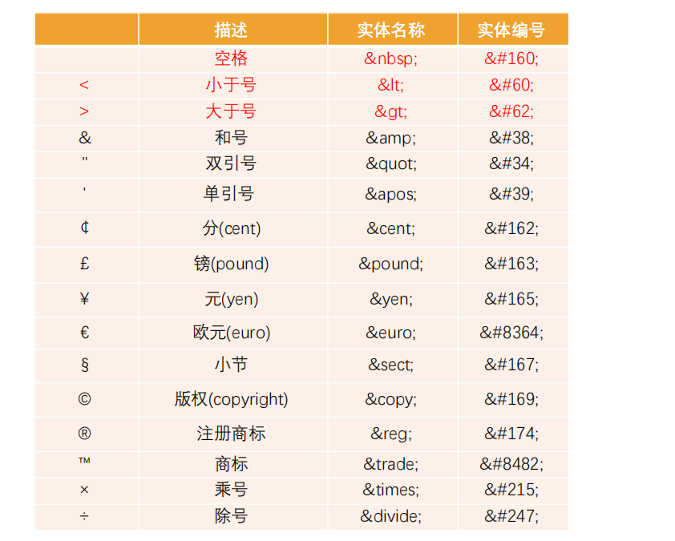

## 2、URL地址

* URL 代表着是统一资源定位符（***Uniform Resource Locator***）

* **通俗点说：**URL 无非就是一个给定的独特资源在 Web 上的地址。

  * 理论上说，每个有效的 URL 都指向一个唯一的资源；

  * 这个资源可以是一个 HTML 页面，一个 CSS 文档，一幅图像，等等；

* URL的标准格式如下：

  * 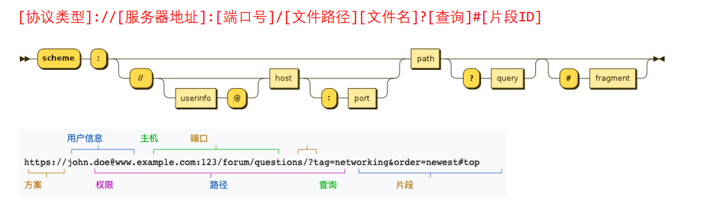

* **URL和URI的区别**

  * **和URI的区别**
    * URI = Uniform Resource Identifier 统一资源**标志符，**用于标识 Web 技术使用的逻辑或物理资源**；**
    * URL = Uniform Resource Locator 统一资源**定位符，**俗称网络地址，相当于网络中的门牌号**；**
  * **URI在某一个规则下能把一个资源独一无二的识别出来。**
    * URL作为一个网络Web资源的地址，可以唯一将一个资源识别出来，所以URL是一个URI；
    * 所以URL是URI的一个子集；
    * 但是URI并不一定是URL
  * **locators are also identifiers**, so every URL is also a URI, but there are URIs which are not URLs.

## 3、元素语义化

* 元素的语义化：用正确的元素做正确的事情。
* 标签语义化的好处
  * 方便代码维护；
  * 减少让开发者之间的沟通成本；
  * 能让语音合成工具正确识别网页元素的用途，以便作出正确的反应；
  * 有利于SEO；

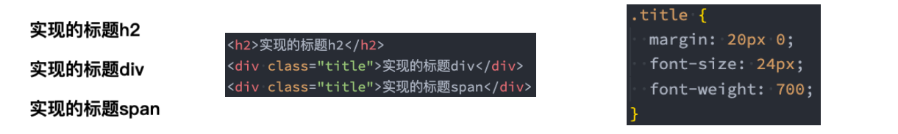

## 4、SEO优化

搜索引擎优化（英语：search engine optimization，缩写为SEO）是通过了解搜索引擎的运作规则来调整网站，以及提高网站在有关搜索引擎内排名的方式

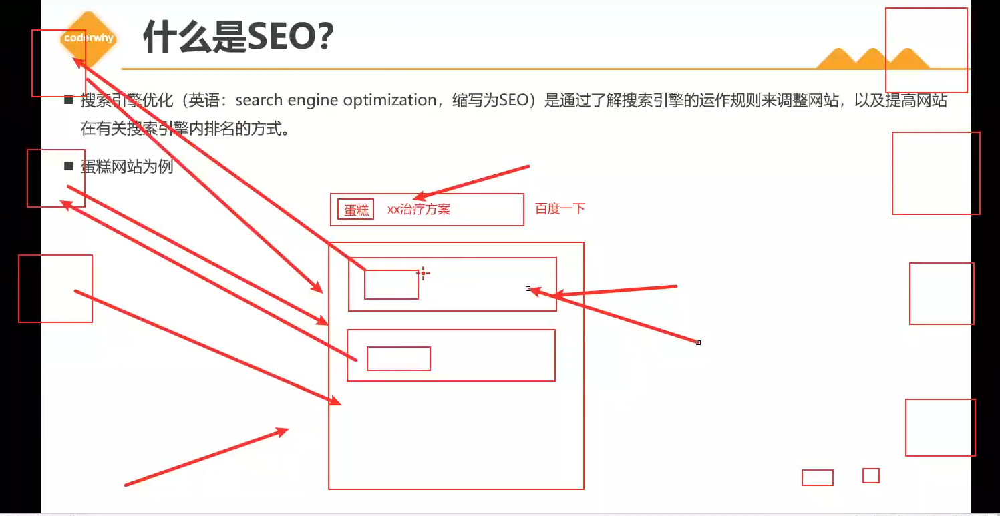


## 5、字符编码

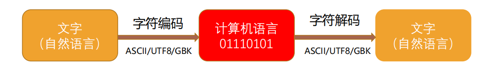

