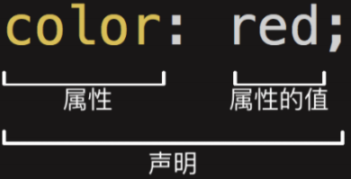

# 一、认识CSS

## 1、认识CSS

### （1）CSS

​		CSS表示层叠样式表（Cscading **S**tyle **S**heet，简称：CSS，又称为又称**串样式列表**、**级联样式表**、**串接样式表**、**阶层式样式表**）是为网页添加样式的代码。

### （2）CSS是一种语言吗

​		MDN解释：CSS 也不是真正的编程语言，甚至不是标记语言。它是一门样式表语言；

​		MDN解释：CSS 也不是真正的编程语言，甚至不是标记语言。它是一门样式表语言；

## 2、CSS的历史

### （1）发展历程

​	早期的网页都是**通过HTML来编写**的，但是我们希望**HTML页面可以更加丰富:**

* 这个时候就增加了很多具备特殊样式的元素：比如i、strong、del等等；
* 后来也有不同的浏览器实现各自的样式语言，但是没有统一的规划；
* 1994年，哈肯·维姆·莱和伯特·波斯合作设计CSS，在1996年的时候发布了CSS1；
*  直到1997年初，W3C组织才专门成立了CSS的工作组，1998年5月发布了CSS2；
*  在2006~2009非常流行 “DIV+CSS”布局的方式来替代所有的html标签；
*  从CSS3开始，所有的CSS分成了不同的模块（modules），每一个“modules”都有于CSS2中额外增加的功能，以及向后兼容。
*  直到2011年6月7日，CSS 3 Color Module终于发布为W3C Recommendation。

### （2）总结

* 总结：CSS的出现是**为了美化HTML**的，并且让**结构（HTML）与样式（CSS）分离**；

  * 美化方式一：为HTML添加各种各样的样式，比如颜色、字体、大小、下划线等等；‘
  * 美化方式二：对HTML进行布局，按照某种结构显示（CSS进行布局 – 浮动、flex、grid）；


## 3、CSS结构

声明（**Declaration**）一个**单独的CSS规则**，如 color: red; 用来指定添加的CSS样式。

* 属性名（Property name）：要添加的css规则的名称；
* 属性值（Property value）：要添加的css规则的值；




# 二、CSS样式应用到元素

## 1、三种方法

CSS提供了3种方法，可以将CSS样式应用到元素上：

* 内联样式（inline style）

* 内部样式表（internal style sheet）、文档样式表（document style sheet）、内嵌样式表（embed style sheet）

* 外部样式表（external style sheet）

## 2、内联样式（inline style）

* **内联样式（inline style），**也有人翻译成行内样式。
  * 内联样式表存在于HTML元素的style属性之中
* CSS样式之间用分号;隔开，建议每条CSS样式后面都加上分号;
* **很多资料不推荐这种写法：**
  * 1.在原生的HTML编写过程中确实这种写法是不推荐的
  * 2.在Vue的template中某些动态的样式是会使用内联样式的；

```html
<!DOCTYPE html>
<html lang="en">
<head>
  <meta charset="UTF-8">
  <meta http-equiv="X-UA-Compatible" content="IE=edge">
  <meta name="viewport" content="width=device-width, initial-scale=1.0">
  <title>Document</title>
</head>
<body>
  <!-- 内联样式 -->
  <div style="color: red; font-size: 30px;">我是div元素</div>

  <h1 style="font-size: 100px;">我是标题</h1>
</body>
</html>
```

## 3、**内部样式表（internal style sheet）**

* **内部样式表（internal style sheet）**
  * 将CSS放在HTML文件<head>元素里的<style>元素之中
* 在Vue的开发过程中，**每个组件也会有一个style元素，和内部样式表非常的相似（原理并不相同）**；

```html
<!DOCTYPE html>
<html lang="en">
<head>
  <meta charset="UTF-8">
  <meta http-equiv="X-UA-Compatible" content="IE=edge">
  <meta name="viewport" content="width=device-width, initial-scale=1.0">
  <title>Document</title>

  <style>
      /* 选择器 */
      /* 两个div都可以找到 */
      /* div{
        color: red; 
        font-size: 30px; 
        background-color: orange;
      } */
      /* 找到class为.div-one的元素 */
      .div-one{
        color: red; 
        font-size: 30px; 
        background-color: blue;
      }
  </style>
</head>
<body>
  <!-- 内联样式 -->
  <div class="div-one">我是div元素</div>
  <div>
    我也是div元素
  </div>
  <p>
    我是段落
  </p>
  <h1>
    我是标题
  </h1>
</body>
</html>
```

## 4、外部样式表（external style sheet）

* **外部样式表（external style sheet）** 是将css编写一个独立的文件中，并且通过<link>元素引入进来；
* **使用外部样式表主要分成两个步骤：**
  * 第一步：将css样式在一个独立的css文件中编写（后缀名为.css）；
  * 第二步：通过<link>元素引入进来；


* **@import**
  * 可以在style元素或者CSS文件中使用@import导入其他的CSS文件


## 5、**CSS的注释**

* **CSS代码也可以添加注释来方便阅读：**
  * CSS的注释和HTML的注释是不一样的；
  * /* 注释内容 */

```html
<!DOCTYPE html>
<html lang="en">
<head>
  <meta charset="UTF-8">
  <meta http-equiv="X-UA-Compatible" content="IE=edge">
  <meta name="viewport" content="width=device-width, initial-scale=1.0">
  <title>Document</title>
  <style>
    /* css注释 */
    .box{
      /* 字体大小 */
      font-size: 30px;
      /* 前景色 */
      color: red; 
    }
  </style>
</head>
<body>
    <div class="box">我是盒子</div>
</body>
</html>
```

## 6、推荐顺序


## 7、**CSS属性的官方文档**

### （1）**CSS官方文档地址**

```
https://www.w3.org/TR/?tag=css
```

### （2）**CSS推荐文档地址：**

```
https://developer.mozilla.org/zhCN/docs/Web/CSS/Reference#%E5%85%B3%E9%94%AE%E5%AD%97%E7%B4%A2%E5%BC%95
```

### （3）查询某些CSS是否可用

​	**由于浏览器版本、CSS版本等问题，查询某些CSS是否可用：**

* 可以到https://caniuse.com/查询CSS属性的可用性
* 这个网站在后续的browserlist工具中我们再详细说明；

## 8、**常用的CSS属性**

### （1）font-size：文字大小

```html
<!DOCTYPE html>
<html lang="en">
<head>
  <meta charset="UTF-8">
  <meta http-equiv="X-UA-Compatible" content="IE=edge">
  <meta name="viewport" content="width=device-width, initial-scale=1.0">
  <title>Document</title>
  <style>
    /* font-size */
    .title{
      font-size: 24px;
    }
  </style>
</head>
<body>
  <div class="title">Hello world</div>
</body>
</html>
```


### （2）color：前景色（文字颜色）

color属性用来设置文本内容的**前景色**

包括文字、装饰线、边框、外轮廓等的颜色

```html
<!DOCTYPE html>
<html lang="en">
<head>
  <meta charset="UTF-8">
  <meta http-equiv="X-UA-Compatible" content="IE=edge">
  <meta name="viewport" content="width=1, initial-scale=1.0">
  <title>Document</title> 
  <style>
    .title {
      font-size: 24px;
      color: chocolate; 
    }
  </style>
</head>
<body>  
  <div class="title">我是div啊</div>
</body>
</html>
```


### （3）background-color：背景色

```html
<!DOCTYPE html>
<html lang="en">
<head>
  <meta charset="UTF-8">
  <meta http-equiv="X-UA-Compatible" content="IE=edge">
  <meta name="viewport" content="width=device-width, initial-scale=1.0">
  <title>Document</title>
</head>
<style>
  .title {
    font-size: 24px;
    color: chocolate;
    background-color: black;
  }
</style>
<body>
  
  <div class="title">Hello World</div>

</body>
</html> 
```


### （4）width ：宽度

```HTML
<!DOCTYPE html>
<html lang="en">
<head>
  <meta charset="UTF-8">
  <meta http-equiv="X-UA-Compatible" content="IE=edge">
  <meta name="viewport" content="width=device-width, initial-scale=1.0">
  <title>Document</title>
  <style>
    .title {
      font-size: 24px;
      color: red;
      background-color: black;
      height: 200px;
      width: 200px;
    }
  </style>
</head>
<body> 
  <div class="title">Hell World</div>
  <!-- <span>我是span元素</span> -->
</body>
</html>
```


### （5）height：高度

## 


# 三、补充

## 1、link元素

* link元素是外部资源链接元素，规范了文档与外部资源的关系
  * link元素通常是在head元素中
* 最常用的链接是样式表（CSS）；
  * 此外也可以被用来创建站点图标（比如 “favicon” 图标）；
* **link元素常见的属性：**
  * href：此属性指定被链接资源的URL。 URL 可以是绝对的，也可以是相对的。
  * rel：指定链接类型，常见的链接类型：https://developer.mozilla.org/zh-CN/docs/Web/HTML/Link_types
    * icon：站点图标；
    * stylesheet：CSS样式；
    * 优化方法


```html
<!DOCTYPE html>
<html lang="en">
<head>
  <meta charset="UTF-8">
  <meta http-equiv="X-UA-Compatible" content="IE=edge">
  <meta name="viewport" content="width=device-width, initial-scale=1.0">
  <title>京东(JD.COM)-正品低价、品质保障、配送及时、轻松购物!</title>
  <!-- 引入css -->
  <link rel="stylesheet" href="./css/style.css">
  <!-- 引入icon(站点图标)  -->
  <link rel="icon" href="../images/favicon.ico">
</head>
<body>
  
</body>
</html>
```


## 2、认识进制

​	如何表示二进制、八进制、十六进制? 

* 二进制（0b开头, binary）：其中的数字由0、1组成，可以回顾之前学习过的机器语言。

*  八进制（0o开头, Octonary）：其中的数字由0~7组成。

*  十六进制（0x开头, hexadecimal）：其中的数字由0~9和字母a-f组成（大小写都可以）


## 3、**CSS颜色的表示方法**

### （1）表示方法1-颜色关键字（color keywords）

* 是不区分大小写的标识符，它表示一个具体的颜色；
* https://developer.mozilla.org/zh-CN/docs/Web/CSS/color_value#%E8%AF%AD%E6%B3%95

### （2）表示方法2-RGB颜色

* RGB是一种色彩空间，通过R（red，红色）、G（green，绿色）、B（blue，蓝色）三原色来组成了不同的颜色；
* 也就是通过调整这三个颜色不同的比例，可以组合成其他的颜色；
* RGB各个原色的取值范围是 0~255

### （3）**RGB的表示方法**

RGB颜色可以通过以#为前缀的十六进制字符和函数（rgb()、rgba()）标记表示

* **方式一：十六进制符号：**#RRGGBB[AA]

  * R（红）、G（绿）、B （蓝）和A （alpha）是十六进制字符（0–9、A–F）；A是可选的。
    * 比如，#ff0000等价于#ff0000ff；
* **方式二：十六进制符号：**#RGB[A]

  * R（红）、G（绿）、B （蓝）和A （alpha）是十六进制字符（0–9、A–F）；
* 三位数符号（#RGB）是六位数形式（#RRGGBB）的减缩版。
  
  * 比如，#f09和#ff0099表示同一颜色。
  * 四位数符号（#RGBA）是八位数形式（#RRGGBBAA）的减缩版。
    * 比如，#0f38和#00ff3388表示相同颜色
* **方式三：函数符：** `rgb[a](R, G, B[, A])`
  * R（红）、G（绿）、B （蓝）可以是<number>（数字），或者<percentage>（百分比），255相当于100%。
  * A（alpha）可以是0到1之间的数字，或者百分比，数字1相当于100%（完全不透明）。

```html
<!DOCTYPE html>
<html lang="en">
<head>
  <meta charset="UTF-8">
  <meta http-equiv="X-UA-Compatible" content="IE=edge">
  <meta name="viewport" content="width=device-width, initial-scale=1.0">
  <title>Document</title>
  <style>
    .box {
      /* color: rebeccapurple;
      background-color: red; */
      
      /* background-color: rgb(100, 100, 100); */
      /* background-color: #646464; */

      /* 表示一个纯黑色 */
      /* background-color: rgb(0, 0, 0); */
      /* background-color: #000000; */
      /* background-color: #000; */

      /* 表示一个纯白色 */  
      /* background-color: rgb(255, 255, 255); */
      /* background-color: #FFFFFF; */
      /* background-color: #FFF; */
      background-color: #f30213;
    }
  </style>
</head>
<body>
  <div class="box">哈哈哈哈</div>
</body>
</html>
```

## 4、Chrome浏览器开发者工具

### （1）查看源码

​	打开Chrome调试工具：

* 方式一：右键 – 检查

* 方式二：快捷键 – F12

### （2）其他技巧

* 快捷键：ctrl+ 可以调整页面或者调试工具的字体大小；

* 可以通过删除某些元素来查看网页结构;

* 可以通过增删css来调试网页样式;


## 5、浏览器渲染的流程


**html和css渲染的时候，html是不用等待css的**


# 四、CSS属性详解

## 1、CSS文本的属性

### （1）CSS属性 – text-decoration（常用）

* **text-decoration用于设置文字的装饰线**
  *  decoration是装饰/装饰品的意思;
* text-decoration有如下常见取值:
  * none：无任何装饰线
    * **可以去除a元素默认的下划线**
  * underline：下划线
  * overline：上划线
  * line-through：中划线（删除线）

```html
<!DOCTYPE html>
<html lang="en">
<head>
  <meta charset="UTF-8">
  <meta http-equiv="X-UA-Compatible" content="IE=edge">
  <meta name="viewport" content="width=device-width, initial-scale=1.0">
  <title>Document</title>
  <link rel="stylesheet" href="./css/reset.css">
  <style>
    .baidu {
      text-decoration: underline;
      cursor: pointer;
    }
    .google {
      text-decoration: line-through;
      /* 设置文本的颜色（前景色）-->线也设置了颜色 */
      color: red;
    }
    .bing {
      text-decoration: overline;
    }

    /* 将默认的线除去 */
    a {
      text-decoration: none;
    }
    
  </style>
</head>
<body>
  <!-- a元素默认有添加text-decoration -->
  <a href="http://www.baidu.com">百度一下</a>

  <!-- span元素也添加装饰线 -->
  <span class="baidu">百度一下</span>

  <!-- 装饰线其他值  -->
  <span class="google">Google一下</span>
  <span class="bing">必应一下</span>

  <a href="http://www.taobao.com">淘宝一下</a>
</body>
</html>
```

* a元素有下划线的本质是被添加了text-decoration属性
* 清除元素的默认属性通常在目录下面创建一个css文件夹，下面reset.css


### （2）text-transform(一般)

* text-transform用于设置文字的大小写转换
  * Transform单词是使变形/变换(形变);
* text-transform有几个常见的值
  * capitalize：(使…首字母大写, 资本化的意思)将每个单词的首字符变为大写
  * uppercase：(大写字母)将每个单词的所有字符变为大写
  * lowercase：(小写字母)将每个单词的所有字符变为小写
  * none：没有任何影响
* 实际开发中用JavaScript代码转化的更多

```html
<!DOCTYPE html>
<html lang="en">
<head>
  <meta charset="UTF-8">
  <meta http-equiv="X-UA-Compatible" content="IE=edge">
  <meta name="viewport" content="width=device-width, initial-scale=1.0">
  <title>Document</title>
  <style>
    .info {
      text-transform: capitalize;
      text-transform: uppercase;
      text-transform: lowercase;
    }
  </style>
</head>
<body>

  <div class="info">
    my name is zky!
  </div>
  <p>
    有关 CSS 选择器语法的初学者介绍，请参阅 CSS 选择器教程。注意，规则定义中的任何 CSS 语法错误都将使整个规则无效，无效的规则将被浏览器忽略。注意 CSS 定义完全是基于（ASCII）文本的，而 DOM-CSS / CSSOM（规则管理系统）是基于对象的。
  </p>
</body>
</html>
```


### （3）text-indent(一般)

* text-indent用于设置第一行内容的缩进
* text-indent: 2em; 刚好是缩进2个文字

```html
<!DOCTYPE html>
<html lang="en">
<head>
  <meta charset="UTF-8">
  <meta http-equiv="X-UA-Compatible" content="IE=edge">
  <meta name="viewport" content="width=device-width, initial-scale=1.0">
  <title>Document</title>
  <style>
    p {
      font-size: 10px;
      /* text-indent: 值应该根据实际的字体来调节; */
      /* em:相对于字体的大小 */
      /* text-indent: 20px; */
      text-indent: 2em;
    }
  </style>
</head>
<body>

  <h2>标题</h2>
  <p>
    有关 CSS 选择器语法的初学者介绍，请参阅 CSS 选择器教程。注意，规则定义中的任何 CSS 语法错误都将使整个规则无效，无效的规则将被浏览器忽略。注意 CSS 定义完全是基于（ASCII）文本的，而 DOM-CSS / CSSOM（规则管理系统）是基于对象的。
  </p>

</body>
</html>
```


### （4）**text-align(重要)**

* **text-align: 直接翻译过来设置文本的对齐方式;**
* **MDN:** **定义行内内容（例如文字）如何相对它的块父元素对齐**;
* **常用的值**
  * left：左对齐
  * right：右对齐
  * center：正中间显示
  *  justify：两端对齐，最后一行不起作用

inline的常规对齐方式设置

```html
<!DOCTYPE html>
<html lang="en">
<head>
  <meta charset="UTF-8">
  <meta http-equiv="X-UA-Compatible" content="IE=edge">
  <meta name="viewport" content="width=device-width, initial-scale=1.0">
  <title>Document</title>
  <style>
    .box {
      background-color: #F00;
      color: white;
      /* text-align: center; */
      /* text-align: left; */
      /* text-align: right; */
      /* 需要特殊配置 */
      text-align: justify;  
    }
  </style>
</head>
<body>
   <div class="box">我是div元素</div>
</body>
</html>
```

图片、input居中

```html
<!DOCTYPE html>
<html lang="en">
<head>
  <meta charset="UTF-8">
  <meta http-equiv="X-UA-Compatible" content="IE=edge">
  <meta name="viewport" content="width=device-width, initial-scale=1.0">
  <title>Document</title>
  <style>
    .box {
      background-color: #F00;
      height: 300px;

      /* 让图片居中 */
      text-align: center;
    }
    img {
      width: 200px;
    }
  </style>
</head>
<body>
  <div class="box">
    <!--  -->
    
    <!-- input也能text-align居中 -->
    <input type="text">
  </div>
</body>
</html>
```

只能用于行内级的居中不能用于快级的居中


```html
<!DOCTYPE html>
<html lang="en">
<head>
  <meta charset="UTF-8">
  <meta http-equiv="X-UA-Compatible" content="IE=edge">
  <meta name="viewport" content="width=device-width, initial-scale=1.0">
  <title>Document</title>
  <style>
    .box {
      background-color: #F00;
      height: 300px;

      text-align: center;
    }
    .content {
      background-color: #0f0;
      height: 200px;
      width: 200px;

      /* 修改为inline级 */
      /* display: inline-block; */

      /* 设置margin */
      margin: 0 auto;
    }
  </style>
</head>
<body>
  <div class="box">
    <div class="content"></div>
  </div>
</body>
</html>
```

justify的使用

```html
<!DOCTYPE html>
<html lang="en">
<head>
  <meta charset="UTF-8">
  <meta http-equiv="X-UA-Compatible" content="IE=edge">
  <meta name="viewport" content="width=device-width, initial-scale=1.0">
  <title>Document</title>
  <style>
    .box {
      width: 300px;
      background-color: #f00;
      color: white;

      /* justify两端对齐：最后一行不起作用 */
      /* text-align: justify; */

      /* 思考：怎么使得最后一行是起作用的？ */
      text-align-last: justify;
    }
  </style>
</head>
<body>
  <div class="box">
    希腊雅典阿提卡动物园的兽医，正在抢救一头小老虎。这是一头遭遗弃的小白虎，据信是非法野生动物贸易的受害者。

路透社17日报道，小白虎是清洁工2月28日在动物园停车场的垃圾桶下发现的，3个月大。清洁工立即通知了动物园。

“没有人知道它从哪里来，也不知道它怎么来的。”动物园创始人让-雅克·勒苏厄说，这显然是肆无忌惮的行为，非法获得这只小白虎后，又因为它残疾而决定抛弃它。
Similarly, each contiguous sequence of sibling text nodes generates a text sequence containing their text contents, which is assigned the same styles as the generating text nodes. If the sequence contains no text, however, it does not generate a text sequence.
  </div>
</body>
</html>
```


### （5）**letter-spacing、word-spacing(一般)**

* **letter-spacing、word-spacing分别用于设置字母、单词之间的间距**
  * 默认是0，可以设置为负数

```html
<!DOCTYPE html>
<html lang="en">
<head>
  <meta charset="UTF-8">
  <meta http-equiv="X-UA-Compatible" content="IE=edge">
  <meta name="viewport" content="width=device-width, initial-scale=1.0">
  <title>Document</title>
  <style>
    .box {
      /* 设置字母与字母之间的间隙 */
      letter-spacing: 10px;

      /* 设置单词与单词之间的空隙 */
      word-spacing: 10px;
    }
  </style>
</head>
<body>
  <div class="box">my name is zkyaaa</div>
</body>
</html>
```


## 2、CSS字体的属性

### （1）**font-size**

* **font-size决定文字的大小**
* 常用的设置
  * 具体数值+单位
    * 比如100px
    * 也可以使用em单位(不推荐)：1em代表100%，2em代表200%，0.5em代表50%
  * 百分比
    * 基于父元素的font-size计算，比如50%表示等于父元素font-size的一半

```html
<!DOCTYPE html>
<html lang="en">
<head>
  <meta charset="UTF-8">
  <meta http-equiv="X-UA-Compatible" content="IE=edge">
  <meta name="viewport" content="width=device-width, initial-scale=1.0">
  <title>Document</title>
  <style>
    .home {
      font-size: 20px;
    }
    .box {
      /* 字体设置的方式一：px */
      /* font-size: 50px; */

      /* 字体设置的方式二：em */
      /* 了解：em  -->em是相对于父元素的字体的尺寸*/
      /* font-size: 2em; */

      /* 字体设置的方式三：百分比% */
      /* MDN查文档：Percentages	refer to the parent element's font size */
      font-size: 80%;
    }    

    /* .box1 {

    } */
  </style>
</head>
<body>
  <div class="home">
    <div class="box">我是div元素</div>
  </div>
  
  <div class="box1">我是div元素</div>
</body>
</html>
```


### （2）**font-family** 

* font-family用于设置**文字的字体名称**
  * 可以设置**1个或者多个**字体名称;
  * 浏览器会选择列表中第一个该计算机上有安装的字体;
  * 或者是通过 **@font-face 指定的可以直接下载的字体**。

```html
body {
  font-family: 'Franklin Gothic Medium', 'Arial Narrow', Arial, sans-serif;
}

<!DOCTYPE html>
<html lang="en">
<head>
  <meta charset="UTF-8">
  <meta http-equiv="X-UA-Compatible" content="IE=edge">
  <meta name="viewport" content="width=device-width, initial-scale=1.0">
  <title>Document</title>
  <link rel="stylesheet" href="./css/reset.css">
  <style>
    
  </style>
</head>
<body>

</body>
</html>
```


### （3）**font-weight**

* **font-weight用于设置文字的粗细（重量）**
* **常见的取值:** 
  * 100 | 200 | 300 | 400 | 500 | 600 | 700 | 800 | 900 ：每一个数字表示一个重量
  * normal：等于400 
  * bold：等于700
* strong、b、h1~h6等标签的font-weight默认就是bold

```html
<!DOCTYPE html>
<html lang="en">
<head>
  <meta charset="UTF-8">
  <meta http-equiv="X-UA-Compatible" content="IE=edge">
  <meta name="viewport" content="width=device-width, initial-scale=1.0">
  <title>Document</title>
  <style>
    .box {
      /* font-weight: bold; */
      font-weight: 700;
    }
  </style>
</head>
<body>
  <div class="box">我是div元素</div>
  <div>我是div元素</div>
</body>
</html>
```

### （4）**font-style(一般)**

* **font-style用于设置文字的常规、斜体显示**
  * normal：常规显示
  * italic(斜体)：用字体的斜体显示(通常会有专门的字体)
  * oblique(倾斜)：文本倾斜显示(仅仅是让文字倾斜)
* em、i、cite、address、var、dfn等元素的font-style默认就是italic

```html
<!DOCTYPE html>
<html lang="en">
<head>
  <meta charset="UTF-8">
  <meta http-equiv="X-UA-Compatible" content="IE=edge">
  <meta name="viewport" content="width=device-width, initial-scale=1.0">
  <title>Document</title>
  <style>
    .box {
      /* 斜体:字体本身支持斜体时，显示的斜体*/
      /* font-style: italic; */

      /* 倾斜：让文本进行倾斜 */
      font-style: oblique;
    }
  </style>
</head>
<body>
  <div class="box">我是div元素</div>
  <div>我是div元素</div>
</body>
</html>
```

### （5）**font-variant(了解)**

* **font-variant可以影响小写字母的显示形式**
  * variant是变形的意思;
* **可以设置的值如下**
  * normal：常规显示
  * small-caps：将小写字母替换为缩小过的大写字母

```html
<!DOCTYPE html>
<html lang="en">
<head>
  <meta charset="UTF-8">
  <meta http-equiv="X-UA-Compatible" content="IE=edge">
  <meta name="viewport" content="width=device-width, initial-scale=1.0">
  <title>Document</title>
  <style>
    .box {
      font-variant: small-caps;
    }
  </style>
</head>
<body>
  <div class="box">My Name Is Zky</div>
</body>
</html>
```


### （6）**line-height** (重点)

* **line-height用于设置文本的行高**
  * 行高可以先简单理解为一行文字所占据的高度
* 行高的严格定义是：**两行文字基线（baseline）之间的间距**
* 基线（baseline）：**与小写字母x最底部对齐的线**


* **注意区分height和line-height的区别**
  * height：元素的整体高度
  *  line-height：元素中每一行文字所占据的高度
* 应用实例：假设div中只有一行文字，**如何让这行文字在div内部垂直居中**
  * 让line-height等同于height

```html
<!DOCTYPE html>
<html lang="en">
<head>
  <meta charset="UTF-8">
  <meta http-equiv="X-UA-Compatible" content="IE=edge">
  <meta name="viewport" content="width=device-width, initial-scale=1.0">
  <title>Document</title>
  <style>
    .box {
      height: 100px;
      background-color: #f00;
      color: #fff;
      /* 设置height==line-height */
      line-height: 100px;
    }
  </style>
</head>

<body>

  <div class="box"> 我是div元素 </div>

</body>
</html>
```


### （7）**font缩写属性** 

* **font是一个缩写属性**
  * font 属性可以用来作为 font-style, font-variant, font-weight, font-size, line-height 和 font-family 属性的简写;
  * font-style font-variant font-weight font-size/line-height font-family
* **规则:**
  * font-style、font-variant、font-weight可以随意调换顺序，也可以省略
  * /line-height可以省略，如果不省略，必须跟在font-size后面
  * font-size、font-family不可以调换顺序，不可以省略
* 参考：https://developer.mozilla.org/zh-CN/docs/Web/CSS/font#%E8%AF%AD%E6%B3%95

```html
<!DOCTYPE html>
<html lang="en">
<head>
  <meta charset="UTF-8">
  <meta http-equiv="X-UA-Compatible" content="IE=edge">
  <meta name="viewport" content="width=device-width, initial-scale=1.0">
  <title>Document</title>
  <style>
    .box {
      /* 关于字体的属性 */
      /* font-size: 30px;
      font-weight: 700;
      font-variant: small-caps;
      font-style: italic;
      font-family: serif;
      line-height: 30px; */ 

      /* 缩写属性 */
      /* 1.5的行高是相对于font-size的 */
      font: italic small-caps 700 30px/1.5 serif;
    }
  </style>
</head>
<body>
  <div class="box">我是div元素</div>
</body>
</html>
```


## 3、CSS常见选择器

### （1）**CSS选择器（selector）**

**什么是CSS选择器**

* 按照一定的规则选出符合条件的元素，为之添加CSS样式

**选择器的种类繁多，大概可以这么归类**

* 通用选择器（universal selector）
* 元素选择器（type selectors）
* 类选择器（class selectors）
* id选择器（id selectors）
* 属性选择器（attribute selectors）
* 组合（combinators）
* 伪类（pseudo-classes）
* 伪元素（pseudo-elements）

### （2）**通用选择器**

* **通用选择器（universal selector）**
  * 所有的元素都会被选中;
* **一般用来给所有元素作一些通用性的设置**
  * 比如内边距、外边距;
  * 比如重置一些内容;
* 效率比较低，尽量不要使用;

```html
<!DOCTYPE html>
<html lang="en">
<head>
  <meta charset="UTF-8">
  <meta http-equiv="X-UA-Compatible" content="IE=edge">
  <meta name="viewport" content="width=device-width, initial-scale=1.0">
  <title>Document</title>
  <style>
    /* * {
      font-size: 30px;
      background-color: #f00;
    } */

    /* 更推荐的做法 */
    body, p, div, span,h2 {
      margin:0;
      padding: 0;
    }
  </style>
</head>
<body>
  <div>我是div元素</div>
  <p>我是P元素</p>
  
  <div>
    <h2>我是h2元素</h2>
    <p>我也是p元素<span>呵呵呵呵呵</span></p>
  </div>
</body>
</html>
```


### （3）**简单选择器**(重点)

* **简单选择器是开发中用的最多的选择器:**
  * **元素选择器**（type selectors）, 使用元素的名称;
  * **类选择器**（class selectors）, 使用 .类名 ;
  * **id选择器**（id selectors）, 使用 #id;
* 
* **id注意事项**
  * 一个HTML文档里面的id值**是唯一的，不能重复**‘
    * id值如果由多个单词组成，单词之间可以用中划线-、下划线_连接，也可以使用驼峰标识
    * **最好不要用标签名作为id值**
  * 中划线又叫连字符（hyphen）

```html
<!DOCTYPE html>
<html lang="en">
<head>
  <meta charset="UTF-8">
  <meta http-equiv="X-UA-Compatible" content="IE=edge">
  <meta name="viewport" content="width=device-width, initial-scale=1.0">
  <title>Document</title>
  <style>
    div {
      color: red;
    }

    .box {
      color: blue;
    }
    #home {
      color: green;
    }
  </style>
</head>
<body>
  <!-- 在同一个HTML中id要不重复 -->
  <div>我是div1</div>
  <div class="box">我是div2</div>
  <div id="home">我是div3</div>

  <!-- calss/id的名称比较复杂 -->
  <div class="box one"></div>
  <div class="box-one box0-first"></div>
  <div class="box_one box0_first"></div>
  <!-- 大驼峰、小驼峰 -->
  <!-- <div class="boxOne Box0First"></div> -->
  
</body>
</html>
```


### （4）**属性选择器(attribute selectors)**（了解）

* **拥有某一个属性** **[att]**

* **属性等于某个值** **[att=val]**

  * 

* **了解**

  * [attr*=val]: 属性值包含某一个值val;
  
  * [attr^=val]: 属性值以val开头;
  
  * [attr$=val]: 属性值以val结尾
  
  * [attr|=val]: 属性值等于val或者以val开头后面紧跟连接符-;
  
  * [attr~=val]: 属性值包含val, 如果有其他值必须以空格和val分割;
  
  ```html
  <!DOCTYPE html>
  <html lang="en">
  <head>
    <meta charset="UTF-8">
    <meta http-equiv="X-UA-Compatible" content="IE=edge">
    <meta name="viewport" content="width=device-width, initial-scale=1.0">
    <title>Document</title>
  
    <style>
      [title] {
        color: red;
      }
      /* 挑选出来之后在属性=某个值 */
      [title=div] {
        background-color: blue;
      }
  
    </style>
  
  </head>
  <body>
    <div>我是div元素</div>
    <div title="div">我也是div元素</div>
    <p>我是p元素</p>
    <h2 title="h2">我是h2元素</h2>
  </body>
  </html>
  ```
  
  
  
### （5）后代选择器（descendant combinator）（重要）

* **后代选择器一: 所有的后代(直接/间接的后代)**

  * 选择器之间**以空格分割**
  * 

* **后代选择器二: 直接子代选择器(必须是直接自带)**

  * 选择器之间**以 > 分割**
  * 

```html
<!DOCTYPE html>
<html lang="en">
<head>
  <meta charset="UTF-8">
  <meta http-equiv="X-UA-Compatible" content="IE=edge">
  <meta name="viewport" content="width=device-width, initial-scale=1.0">
  <title>Document</title>
  <style>
    /* home的下面的所有的span */
    .home span {
      color: red;
      font-size: 30px;
    }
    /* .home的子代的span元素(紧挨着home的span)设置背景元素 */
    /* 大于号 >表示直接子代 */
    .home > span {
      background-color: green;
    }
  </style>
</head>

<body>
  <div class="home">
    <span>啦啦啦啦啦啦</span>
    <div class="box">
      <p>我是p元素</p>
      <span>呵呵呵呵呵</span>
    </div>

    <div class="content">
      <div class="desc">
        <p>
          <span>哈哈哈哈哈</span>
        </p>
      </div>
    </div>
  </div>

  <!-- 不希望被选中 -->
  <span>嘻嘻嘻嘻</span>
  <div>
    <span>嘿嘿嘿</span>
  </div>

</body>
</html>
```


### （6）弟选择器(sibling combinator)（了解）

* **兄弟选择器一: 相邻兄弟选择器**
  * 使用符号 + 连接
  * 
* **兄弟选择器二: 普遍兄弟选择器 ~**
  * 使用符号 ~ 连接
  * 

```html
<!DOCTYPE html>
<html lang="en">
<head>
  <meta charset="UTF-8">
  <meta http-equiv="X-UA-Compatible" content="IE=edge">
  <meta name="viewport" content="width=device-width, initial-scale=1.0">
  <title>Document</title>
  <style>
    /* 设置相邻兄弟两种方式 */
    /* 方式一 */
    /* .box + div {
      color: red;
    } */
    /* 方式二 */
    .box + .content {
      color: red; 
    }

    /* 设置所有兄弟 */
    .box ~ div {
      font-size: 50px;
    }
  </style>
</head>
<body>
  <div class="home">
    <div class="box">呵呵呵呵</div>
    <div class="content">哈哈哈哈哈哈</div>
    <div>嘻嘻嘻嘻</div>
    <div>嘿嘿嘿嘿</div>
  </div>
</body>
</html>
```

### （7）**选择器组**（重要）

* **交集选择器: 需要同时符合两个选择器条件(两个选择器紧密连接)**
  * 在开发中通常为了精准的选择某一个元素;
  * 
* **并集选择器: 符合一个选择器条件即可(两个选择器以,号分割)**
  * 在开发中通常为了给多个元素设置相同的样式;
  * 

```html
<!DOCTYPE html>
<html lang="en">
<head>
  <meta charset="UTF-8">
  <meta http-equiv="X-UA-Compatible" content="IE=edge">
  <meta name="viewport" content="width=device-width, initial-scale=1.0">
  <title>Document</title>
  <style>
    body, p, h1, h2 {
      color: red;
      font-size: 40px;
    }
  </style>
</head>
<body>
  <p>我是P元素</p>
  <h1>我是h1元素</h1>
</body>
</html>
```


### （8）认识伪类

* **什么是伪类呢?**
* Pseudo-classes: 翻译过来是伪类;
  * 伪类是选择器的一种，它用于选择处于特定状态的元素;
  
* 比如我们经常会实现的: 当手指放在一个元素上时, 显示另外一个颜色;

* **常见的伪类有**
* **1.动态伪类**（dynamic pseudo-classes）
  
  * :link、:visited、**:hover**、:active、:focus
  
* **2.目标伪类**（target pseudo-classes）
  
  * :target
  
* **3.语言伪类**（language pseudo-classes）
* :lang( )
  
* **4.元素状态伪类**（UI element states pseudo-classes）
  
  * :enabled、:disabled、:checked
  
* **5.结构伪类**（structural pseudo-classes）(后续学习)
  
  * :nth-child( )、:nth-last-child( )、:nth-of-type( )、:nth-last-of-type( )
  
  * :first-child、:last-child、:first-of-type、:last-of-type
  
  * :root、:only-child、:only-of-type、:empty
  
  * **6.否定伪类**（negation pseudo-classes）(后续学习)
    * :not()
  * 所有的伪类: https://developer.mozilla.org/zh-CN/docs/Web/CSS/Pseudo-classes

   * **动态伪类（dynamic pseudo-classes)**
        * **使用举例**
               *  a:link 未访问的链接
                   *  a:visited 已访问的链接
                   *  a:hover 鼠标挪动到链接上(重要)
                   *  a:active 激活的链接（鼠标在链接上长按住未松开）
     * **使用注意**
       * :hover必须放在:link和:visited后面才能完全生效
       * :active必须放在:hover后面才能完全生效
       * 所以建议的编写顺序是 :link、:visited、:hover、:active
     * **除了a元素，:hover、:active也能用在其他元素上**
     * **动态伪类 - :focus**
       * :focus指当前**拥有输入焦点的元素**（能接收键盘输入）
         * 文本输入框一聚焦后，背景就会变红色
       * 因为链接a元素可以**被键盘的Tab键选中聚焦**，**所以:focus也适用于a元素**
       * **动态伪类编写顺序建议为**
         * :link、:visited、:focus、:hover、:active
       * **直接给a元素设置样式，相当于给a元素的所有动态伪类都设置了**
         * 相当于a:link、a:visited、a:hover、a:active、a:focus的color都是red···

```html
<!DOCTYPE html>
<html lang="en">
<head>
  <meta charset="UTF-8">
  <meta http-equiv="X-UA-Compatible" content="IE=edge">
  <meta name="viewport" content="width=device-width, initial-scale=1.0">
  <title>Document</title>
  <style>
    /* a元素的链接从来没有被访问过 */
    a:link {
      color: red;
    }

    /* a元素被访问过了颜色 */
    a:visited {
      color: green;
    }

    /* a/input 元素聚焦（获取焦点） */
    a:focus {
      color: yellow;
    }

    /* a元素鼠标放在上面 */
    a:hover {
      color: blue;
    }

    /* 点下去了，但是还没松手 */
    a:active {
      color: purple;
    }

    /* a上面的所有的状态都是blue */
    /* a {
      color: blue;
    } */

  </style>
</head>
<body>
  <a href="http://www.mi.com">小米</a>
  <a href="http://www.baidu.com">百度</a>

  <input type="text">

  <div>我是div元素</div>
</body>
</html>
```

###  （9）**伪元素（pseudo-elements）**(重要)

* **常用的伪元素有**
  * :first-line、::first-line
  * :first-letter、::first-letter 
  * :before、::before
  * :after、::after
* 为了区分伪元素和伪类，建议伪元素使用2个冒号，比如::first-line
* **伪元素 - ::first-line - ::first-letter(了解)**
  * ::first-line可以针对首行文本设置属性
  * ::first-letter可以针对首字母设置属性
  * 
* **伪元素 - ::before和::after(常用)**
  * **::before和::after**用来在一个元素的内容之前或之后插入其他内容（可以是文字、图片)
  * 常通过 content 属性来为一个元素添加修饰性的内容。
  * 

```html
<!DOCTYPE html>
<html lang="en">
<head>
  <meta charset="UTF-8">
  <meta http-equiv="X-UA-Compatible" content="IE=edge">
  <meta name="viewport" content="width=device-width, initial-scale=1.0">
  <title>Document</title>
  <style>
    .before {
      color: red;
    }
    .after {
      color: blue;
    }

    /* 伪元素 */
    .item::before {
      content: "321";
      color: red;
      font-size: 30px;
    }

    .item::after {
      /* content: "abc"; */
      content: url(../images/hot_icon.svg);
      color: green;
      font-size: 40px;

      /* 位置不是很好看 */
      position: relative; /*相对定位*/
      left: 5px;
      top: 2px
    }

    .new::after {
      /* 位置不是很好看 */
      content: url(../images/new_icon.svg);
      /* 位置不是很好看 */
      position: relative;
      left: 5px;
      top: 2px
    }
    
    /* 额外的补充 */
    .box6::after {
      /* 使用伪元素的过程中，不要将content省略 */
      content: "";

      display: inline-block;
      width: 8px;
      height: 8px;
      background-color: #f00;
    }
  </style>
</head>
<body>
  <div class="bax">
    <!-- 还需要考虑换行符 -->
    <span class="before">123</span>
    我是div元素
    <span class="after">abc</span>
  </div>
  
  <div class="box2"> 
    <span class="before">123</span>
    我是box2
    <span class="after">abc</span>
  </div>

  <!-- 伪元素 -->
  <!-- 增加其他的话只需要添加item就可以了 -->
  <div class="box3 item">我是box3</div>
  <div class="box4 item">我是box4</div>
  <div class="box5 new">我是box5</div>

  <!-- 伪元素补充 -->
  <div class="box6">我是box6</div>
</body>
</html>
```


