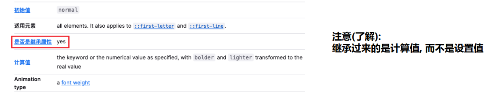
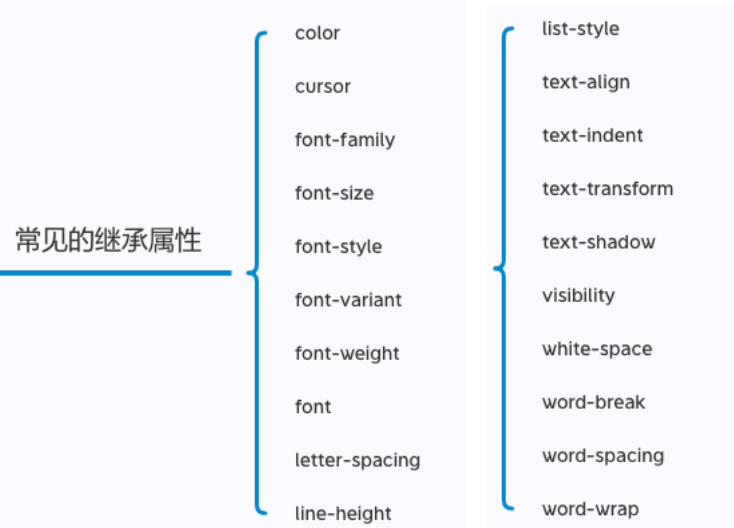
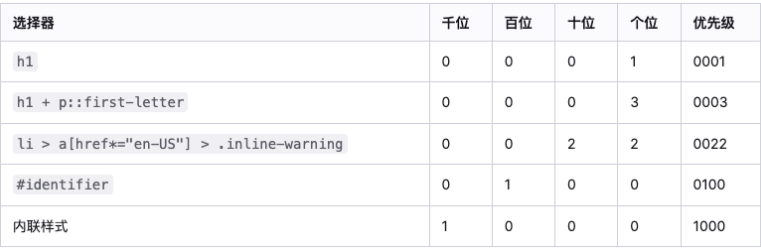
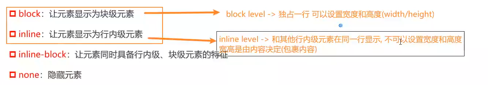
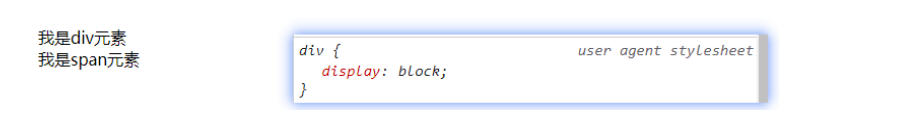
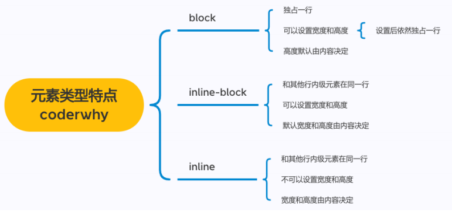
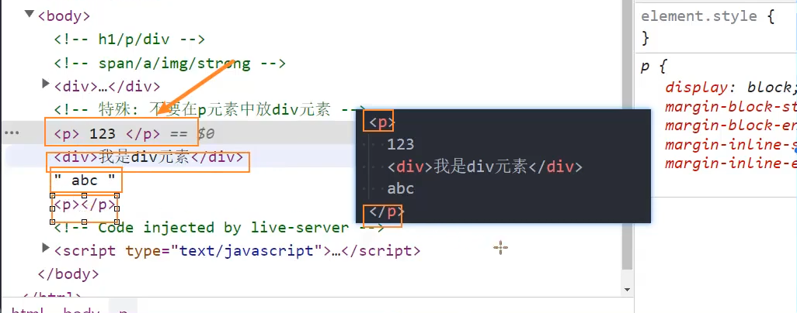
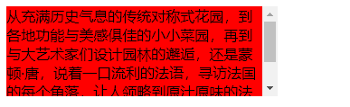

# 一、**CSS继承-层叠-元素类型**

## 1、**CSS的属性继承**

### （1）CSS的某些属性具有继承性(Inherited):

* 如果一个属性具备继承性, 那么在该元素上设置后, 它的后代元素都可以继承这个属性;
* 当然, 如果后代元素自己有设置该属性, 那么优先使用后代元素自己的属性(不管继承过来的属性权重多高);

**默认继承**

```html
<!DOCTYPE html>
<html lang="en">
<head>
  <meta charset="UTF-8">
  <meta http-equiv="X-UA-Compatible" content="IE=edge">
  <meta name="viewport" content="width=device-width, initial-scale=1.0">
  <title>Document</title>
  <style>
    /* h1, p, span, strong {
      color: red;
    } */
    div.box {
      color: red;
    }

  </style>
</head>
<body>
  
  <div class="box">
    <h1>我是h1元素</h1>
    <p>
      我是p元素
      <span>哈哈哈哈</span>
      <strong>呵呵呵呵</strong>
    </p>
    <span>我是span元素</span>
  </div>
</body>
</html>
```

**继承计算值**

```html
<!DOCTYPE html>
<html lang="en">
<head>
  <meta charset="UTF-8">
  <meta http-equiv="X-UA-Compatible" content="IE=edge">
  <meta name="viewport" content="width=device-width, initial-scale=1.0">
  <title>Document</title>
  <style>
    .box{
      color: red;
      /* font-size: 30px; */
      /* 相对于自身字体（父元素的字体） */
      /* 浏览器16px */
      font-size: 2em;  /*32px*/
    }

    p {
      /* font-size: 2em;*/ /*64px*/
    }
  </style>
</head>
<body>
  <div class="box">
    box本身的内容
    <p>我是p元素</p>
  </div>
</body>
</html>
```

**强制继承**

```html
<!DOCTYPE html>
<html lang="en">
<head>
  <meta charset="UTF-8">
  <meta http-equiv="X-UA-Compatible" content="IE=edge">
  <meta name="viewport" content="width=device-width, initial-scale=1.0">
  <title>Document</title>
  <style>
    .box {
      color: red;

      border: 2px solid purple;
    }

    .box p {
      border: inherit;
    }
  </style>
</head>
<body> 
  <div class="box">
    <p>我是p元素</p>
    <h1>我是h1元素</h1>
  </div>
</body>
</html>
```


### （2）**如何知道一个属性是否具有继承性呢?**

* 常见的font-size/font-family/font-weight/line-height/color/text-align都具有继承性;
* **要多学会查阅文档, 文档中每个属性都有标明其继承性的**

* **注意(了解):继承过来的是计算值, 而不是设置值**



### （3）**常见的继承属性**




## 2、**CSS属性的层叠**

### （1）层叠

*  对于一个元素来说, 相同一个属性我们可以通过不同的选择器给它进行多次设置;
*  那么属性会被一层层覆盖上去;
* 但是最终只有一个会生效;


### （2）**那么多个样式属性覆盖上去, 哪一个会生效呢?**

* 判断一: 选择器的权重, 权重大的生效, 根据权重可以判断出优先级;
* 判断二: 先后顺序, 权重相同时, 后面设置的生效;


### （3）**选择器的权重**

* 为了方便比较CSS属性的优先级，可以给CSS属性所处的环境定义一个权值（权重）
  *  ! important：10000
  * 内联样式：1000
  * id选择器：100
  * 类选择器、属性选择器、伪类：10
  * 元素选择器、伪元素：1
  * 通配符：0



```html
<!DOCTYPE html>
<html lang="en">
<head>
  <meta charset="UTF-8">
  <meta http-equiv="X-UA-Compatible" content="IE=edge">
  <meta name="viewport" content="width=device-width, initial-scale=1.0">
  <title>Document</title>
  <style>
    div.box {
      color: red !important;   /*10000*/
    }

    /* id选择器：100 */
    #main {
      color: orange;
    }

    /* 类选择器：10 */
    .box {
      color: blue;
    }

    /* 元素选择器：1 */
    div {
      color: purple;
    }

    /* 通配符选择器：0 */
    * {
      color: yellow;
    }
  </style>
</head>
<body>
  <!-- 内联样式：1000 -->
  <div id="main" class="box one two" style="color: blue;">我是div元素</div>
</body>
</html>
```

## 3、HTML元素的类型

### （1）HTML元素的类型

* 在前面我们会经常提到div是块级元素会独占一行**, **span是行内级元素会在同一行显示.
  * 到底什么是块级元素, 什么是行内级元素呢?

* **HTML定义元素类型的思路:**
  * HTML元素有很多, 比如h元素/p元素/div元素/span元素/img元素/a元素等等;
  * 当我们把这个元素放到页面上时, 这个元素到底占据页面中一行多大的空间呢?
    * 为什么我们这里只说一行呢? 因为垂直方向的高度通常是内容决定的;
  * 比如一个h1元素的标题, 我们必然是希望它独占一行的, 其他的内容不应该和我的标题放在一起;
  * 比如一个p元素的段落, 必然也应该独占一行, 其他的内容不应该和我的段落放在一起;
  * 而类似于img/span/a元素, 通常是对内容的某一个细节的特殊描述, 没有必要独占一行;
* **为了区分哪些元素需要独占一行**, **哪些元素不需要独占一行**, **HTML将元素区分(本质是通过CSS的)成了两类**:
  * **块级元素**（block-level elements）: 独占父元素的一行
  * **行内级元素**（inline-level elements）:多个行内级元素可以在父元素的同一行中显示



```html
<!DOCTYPE html>
<html lang="en">
<head>
  <meta charset="UTF-8">
  <meta http-equiv="X-UA-Compatible" content="IE=edge">
  <meta name="viewport" content="width=device-width, initial-scale=1.0">
  <title>Document</title>
</head>
<body>
  <!-- h1/p/div/span/a/img -->
  <!-- HTML考虑一个问题：每个元素在页面当中到底占据多大的空间 -->
  <!-- 某些元素非常重要：独占一行->类型：块级元素（block level）:h元素/p/div  -->
  <!-- 某些元素属于内容的一部分：没有必要独占一行，其他内容在同一行显示 
                            -> 类型：行内级元素（inline level） 
                            -> span/a/img/strong/i   
   -->

  <h1>我是标题</h1>
  <p></p>

</body>
</html>
```


### （2）通过CSS修改元素类型

* 事实上元素没有本质的区别:
  * div是块级元素, span是行内级元素;
  * div之所以是块级元素仅仅是因为浏览器默认设置了display属性而已;



```html
<!DOCTYPE html>
<html lang="en">
<head>
  <meta charset="UTF-8">
  <meta http-equiv="X-UA-Compatible" content="IE=edge">
  <meta name="viewport" content="width=device-width, initial-scale=1.0">
  <title>Document</title>
  <style>
    /* 10 */
    .box{
      height: 100px;
      background-color: #f00;
      color: #fff;

      /* 修改div元素的特性：层叠*/
      display: inline;
    }

    span {
      background-color: #0f0;
      display: block;
    }
    
  </style>
</head>
<body>
  <div class="box">我是div元素</div>
  <span>我是span元素</span>
  <a href="http://www/baidu.com">百度一下</a>
</body>
</html>
```


### （3）**CSS属性 - display**

* **CSS中有个display属性，能修改元素的显示类型，有4个常用值**
  * block：让元素显示为块级元素
  * inline：让元素显示为行内级元素
  * inline-block：让元素同时具备行内级、块级元素的特征
  * none：隐藏元素
* 事实上display还有其他的值, 比如flex


### （4）display值的特性(非常重要)

* **block元素:**
  *  独占父元素的一行
  * 可以随意设置宽高
  * 高度默认由内容决定

* **inline-block元素:**
  * 跟其他行内级元素在同一行显示
  * 可以随意设置宽高
  *  可以这样理解
    * 对外来说，它是一个行内级元素
    * 对内来说，它是一个块级元素
* **inline:**
  * 跟其他行内级元素在同一行显示;
  * 不可以随意设置宽高;
  * 宽高都由内容决定;



```html
<!DOCTYPE html>
<html lang="en">
<head>
  <meta charset="UTF-8">
  <meta http-equiv="X-UA-Compatible" content="IE=edge">
  <meta name="viewport" content="width=device-width, initial-scale=1.0">
  <title>Document</title>
  <style>
    /* 宽高不满意：自己来设置 */
    div {
      background-color: #f00;
      width: 200px;
      height: 200px;
    }

    span {
      background-color: #0f0;
      width: 200px;
      height: 200px;
    }

    img {
      height: 200px;
      width: 150px;
    }

    input {
      height: 60px;
    }
  </style>
</head>
<body>
  <div>我是div元素</div>

  <!-- 行内级元素设置宽度和高度不生效？？？  行内非替换元素不可以设置宽高-->
  <span>我是span元素</span>

  
  <!-- img元素：inline-replaced ->行内替换元素 -->
  <!-- 行内替换元素：1、和其他行内级元素在同一行显示 2、可以设置宽度和高度 -->
  
  <input type="text">
</body>
</html>
```


**inline-block特点**

```html
<!DOCTYPE html>
<html lang="en">
<head>
  <meta charset="UTF-8">
  <meta http-equiv="X-UA-Compatible" content="IE=edge">
  <meta name="viewport" content="width=device-width, initial-scale=1.0">
  <title>Document</title>
  <style>
    .box{
      background-color: #f00;

      /* display: inline; */
      /*
      inline: 可以和其他元素在同一行显示
      block: 可以设置宽度和高度
      */
      display: inline-block;
      width: 200px;
      height: 200px;
    }
  </style>
</head>
<body>

  <a href="#">百度一下</a>
  <div class="box">我是box</div>
  <span>我是span元素</span>
</body>
</html>
```


### （5）**编写HTML时的注意事项**

* **块级元素、inline-block元素**
  *  一般情况下，可以包含其他任何元素（比如块级元素、行内级元素、inline-block元素）
  * 特殊情况，p元素不能包含其他块级元素
* **行内级元素（比如a、span、strong等）**
  *  一般情况下，只能包含行内级元素





```html
<!DOCTYPE html>
<html lang="en">
<head>
  <meta charset="UTF-8">
  <meta http-equiv="X-UA-Compatible" content="IE=edge">
  <meta name="viewport" content="width=device-width, initial-scale=1.0">
  <title>Document</title>
</head>
<body>
  <!-- h1/p/div -->
  <!-- span/a/img/strong  -->
  <!-- 一般：块级元素中可以放行内级元素 -->
  <div>
    <h1> </h1>
    <p></p>
    <a href=""></a>
    
  </div>

  <!-- 特殊：不要在P元素中放div元素 -->
  <p>
    123
    <div>我是div元素</div>
    abc
  </p>

  <!-- 行内级元素中不要放块级元素 -->
  <span>
    321
    <div></div>
    <p></p>
    cba
  </span>

</body>
</html>
```


### （6）**元素隐藏方法**

* **方法一: display设置为none**
  * 元素不显示出来, 并且也不占据位置, 不占据任何空间(和不存在一样);
* **方法二: visibility设置为hidden**
  * 设置为hidden, 虽然元素不可见, 但是会占据元素应该占据的空间;
  * 默认为visible, 元素是可见的;
* **方法三: rgba设置颜色, 将a的值设置为0**
  * rgba的a设置的是alpha值, 可以设置透明度, 不影响子元素;
* **方法四: opacity设置透明度, 设置为0**
  * 设置整个元素的透明度, 会影响所有的子元素;

**元素的隐藏-display-visibility**

```html
<!DOCTYPE html>
<html lang="en">
<head>
  <meta charset="UTF-8">
  <meta http-equiv="X-UA-Compatible" content="IE=edge">
  <meta name="viewport" content="width=device-width, initial-scale=1.0">
  <title>Document</title>
  <style>
    .box {
      display: none;
    }

    .content {
      visibility: hidden;
    }
  </style>
</head>
<body>
  <div class="box">我是div元素</div>
  <div>哈哈哈哈哈</div> 

  <div class="content">我是content元素</div>
  <div>呵呵呵呵呵</div>
</body>
</html>
```

**元素的隐藏-alpha-opacity**

```html
<!DOCTYPE html>
<html lang="en">
<head>
  <meta charset="UTF-8">
  <meta http-equiv="X-UA-Compatible" content="IE=edge">
  <meta name="viewport" content="width=device-width, initial-scale=1.0">
  <title>Document</title>
  <style>
    /* alpha: 只是设置当前color/bgc其中的颜色透明度为某一个值, 不会影响子元素 */
    .box1 {
      /* 不是很推荐 */
      /* color module */
      /* color: #ff000088; */
      /* webpack -> postcss -> browserslist -> rgba() */
      /* 推荐下面的写法 a -> alpha 0~1 */
      /* color: rgba(255, 0, 0, 0.5); */

      /* 通过颜色来隐藏 */
      /* color: rgba(0, 0, 0, 0) */

      /* 通过背景颜色透明度来隐藏 */
      /* background-color: rgba(0, 0, 0, 0); */
      background-color: transparent; /* rgba(0,0,0,0) */
    }

    /* opacity: 设置透明度, 并且会携带所有的子元素都有一定的透明度 */
    .box2 {
      opacity: 0.5;
    }
  </style>
</head>
<body>
  
  <div class="box1">
    我是box1
    
  </div>
  <div class="box2">
    我是box2
    
  </div>

</body>
</html>
```


### （7）**CSS属性 - overflow**

* **overflow用于控制内容溢出时的行为**
* visible：溢出的内容照样可见
* hidden：溢出的内容直接裁剪
* scroll：溢出的内容被裁剪，但可以通过滚动机制查看
  * 会一直显示滚动条区域，滚动条区域占用的空间属于width、height
* auto：自动根据内容是否溢出来决定是否提供滚动机制

```html
<!DOCTYPE html>
<html lang="en">
<head>
  <meta charset="UTF-8">
  <meta http-equiv="X-UA-Compatible" content="IE=edge">
  <meta name="viewport" content="width=device-width, initial-scale=1.0">
  <title>Document</title>
  <style>
    .box {
      width: 300px;
      height: 100px;
      background-color: #f00;

      /* overflow: visible */
      /* overflow: hidden; */
      /* overflow: scroll; */
      overflow: auto;
    }
  </style>
</head>
<body>
  
  <div class="box">
    从充满历史气息的传统对称式花园，到各地功能与美感俱佳的小小菜园，再到与大艺术家们设计园林的邂逅，还是蒙顿·唐，说着一口流利的法语，寻访法国的每个角落，让人领略到原汁原味的法国风情，体会法国人融入骨子里的浪漫与优雅。
  </div>

</body>
</html>
```




### （8）**CSS样式不生效技巧**

* 选择器的优先级太低
* 选择器没选中对应的元素
* CSS属性的使用形式不对
  * 元素不支持此CSS属性，比如span默认是不支持width和height的
  * 浏览器不支持此CSS属性，比如旧版本的浏览器不支持一些css module3的某些属性
  * 被同类型的CSS属性覆盖，比如font覆盖font-size
* 充分利用浏览器的开发者工具进行调试（增加、修改样式）、查错

