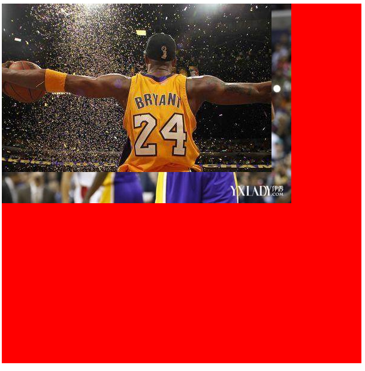
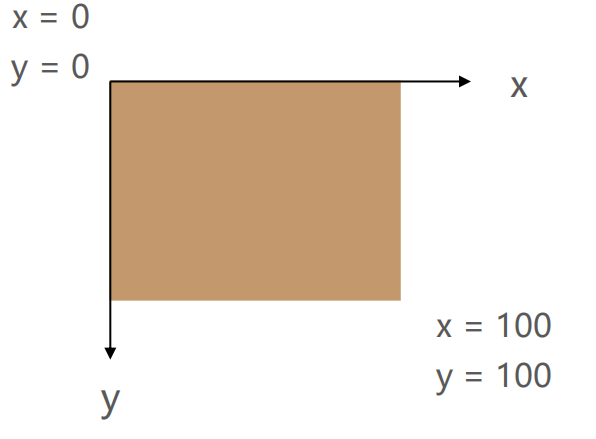
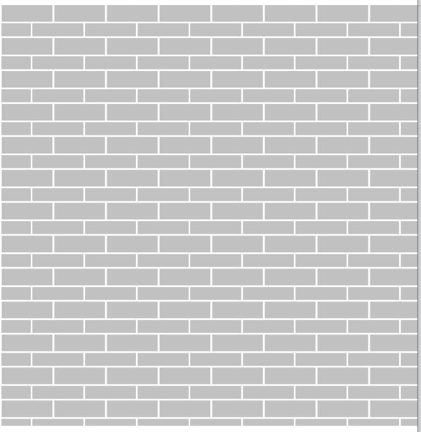
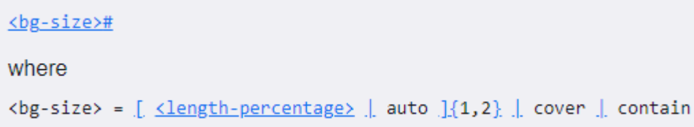
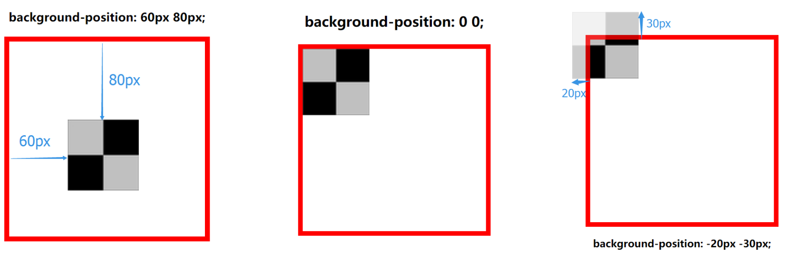
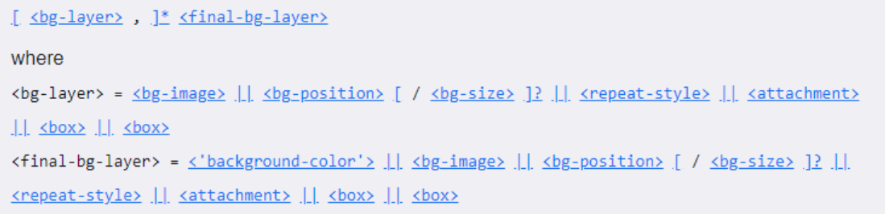
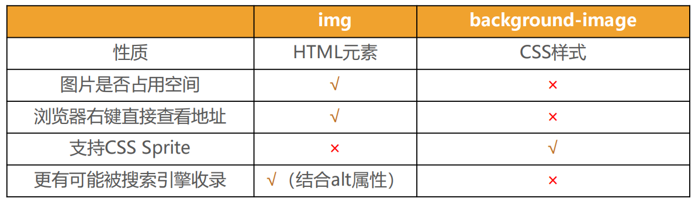

# CSS设置背景

## 一、CSS背景相关属性

### 1、background-image

- background-image用于设置元素的背景图片

	- 会盖在(不是覆盖)background-color的上面

- 如果设置了多张图片
	- 设置的第一张图片将显示在最上面，其他图片按顺序层叠在下面

◼ **注意：如果设置了背景图片后，元素没有具体的宽高，背景图片是不会显示出来的**

```html
<!DOCTYPE html>
<html lang="en">
<head>
  <meta charset="UTF-8">
  <meta http-equiv="X-UA-Compatible" content="IE=edge">
  <meta name="viewport" content="width=device-width, initial-scale=1.0">
  <title>Document</title>
  <style>
    .box {
      /* 要有宽度和高度才能显示图片 */
      width: 600px;
      height: 600px;
      background-color: #F00;

      /* 设置背景图片 */
      /* url引入资源 */
      background-image: url(../images/kobe01.jpg), url(../images/kobe02.png);
      background-repeat: no-repeat;
    }

    /* span没有宽高 */
    /* span {
      width: 30px;
      height: 30px;
      background-image: url();
    } */
  </style>
</head>
<body>
  <div class="box"></div>
  <span></span>
</body>
</html>
```




### 2、background-repeat

* background-repeat用于设置背景图片是否要平铺

* 常见的设值有
	* repeat：平铺
	* no-repeat：不平铺
	* repeat-x：只在水平方向平铺
	* repeat-y：只在垂直平方向平铺



```html
<!DOCTYPE html>
<html lang="en">
<head>
  <meta charset="UTF-8">
  <meta http-equiv="X-UA-Compatible" content="IE=edge">
  <meta name="viewport" content="width=device-width, initial-scale=1.0">
  <title>Document</title>
  <style>
    .box {
      /* 要有宽度和高度才能显示图片 */
      width: 600px;
      height: 600px;
      background-color: #F00;

      /* 设置背景图片 */
      /* url引入资源 */
      background-image: url(../images/wall.png);
      /* repeat默认是平铺的 */
      /* background-repeat: no-repeat; */
    }

  </style>
</head>
<body>
  <div class="box"></div>
</body>
</html>
```




### 3、background-size

* background-size用于设置背景图片的大小
	* auto：默认值, 以背景图本身大小显示
	* cover：缩放背景图，以完全覆盖铺满元素,可能背景图片部分看不见
	* contain：缩放背景图，宽度或者高度铺满元素，但是图片保持宽高比
	* percentage：百分比，相对于背景区（background positioning area）
	* length：具体的大小，比如100px



```html
<!DOCTYPE html>
<html lang="en">
<head>
  <meta charset="UTF-8">
  <meta http-equiv="X-UA-Compatible" content="IE=edge">
  <meta name="viewport" content="width=device-width, initial-scale=1.0">
  <title>Document</title>
  <style>
    .box {
      /* 要有宽度和高度才能显示图片 */
      width: 600px;
      height: 600px;
      background-color: #F00;

      /* 设置背景图片 */
      /* url引入资源 */
      background-image: url(../images/kobe01.jpg);
      background-repeat: no-repeat;

      /* 设置背景的尺寸 */
      /* background-size: contain;  */
      /* background-size: cover; */
      /* background-size: 100% 100%; */
      /* background-size: 100px 100px; */
      background-size: 100px auto; 
    }

  </style>
</head>
<body>
  <div class="box"></div>
</body>
</html>
```


### 4、background-position

* background-position用于设置背景图片在水平、垂直方向上的具体位置
	* 可以设置具体的数值 比如 20px 30px;
	* 水平方向还可以设值：left、center、right
	* 垂直方向还可以设值：top、center、bottom
	* 如果只设置了1个方向，另一个方向默认是center



```html
<!DOCTYPE html>
<html lang="en">
<head>
  <meta charset="UTF-8">
  <meta http-equiv="X-UA-Compatible" content="IE=edge">
  <meta name="viewport" content="width=device-width, initial-scale=1.0">
  <title>Document</title>
  <style>
    .box {
      /* 要有宽度和高度才能显示图片 */
      width: 600px;
      height: 600px;
      background-color: #F00;

      /* 设置背景图片 */
      /* url引入资源 */
      background-image: url(../images/kobe01.jpg);
      background-repeat: no-repeat;

      /* 设置背景的位置 */
      /* background-position: 100px 100px; */
      background-position: top right;
    }

  </style>
</head>
<body>
  <div class="box"></div>
</body>
</html>
```

显示图片在中间

```html
<!DOCTYPE html>
<html lang="en">
<head>
  <meta charset="UTF-8">
  <meta http-equiv="X-UA-Compatible" content="IE=edge">
  <meta name="viewport" content="width=device-width, initial-scale=1.0">
  <title>Document</title>
  <style>

    body {
      margin: 0;
    }

    .box {
      /* 要有宽度和高度才能显示图片 */
      height: 498px;
      background-color: #F00;

      /* 设置背景图片 */
      /* url引入资源 */
      background-image: url(../images/mhxy.jpg);

      /* 设置背景的位置为中间 */
      background-position: center;
    }

  </style>
</head>
<body>
  <div class="box"></div>
</body>
</html>
```


### 5、background-attachment

* background-attachment决定背景图像的位置是在视口内固定，或者随着包含它的区块滚动。

* 可以设置以下3个值
	* scroll：此关键属性值表示背景相对于元素本身固定， 而不是随着它的内容滚动
	* local：此关键属性值表示背景相对于元素的内容固定。如果一个元素拥有滚动机制，背景将会随着元素的内容滚动.
	* fixed：此关键属性值表示背景相对于视口固定。即使一个元素拥有滚动机制，背景也不会随着元素的内容滚动。

```html
<!DOCTYPE html>
<html lang="en">
<head>
  <meta charset="UTF-8">
  <meta http-equiv="X-UA-Compatible" content="IE=edge">
  <meta name="viewport" content="width=device-width, initial-scale=1.0">
  <title>Document</title>
  <style>
    .box {
      width: 300px;
      height: 300px;
      overflow: scroll;
      color: #fff;
      background-color: #f00;

      background-image: url(../images/kobe01.jpg);

      /* 附加效果 */
      /* background-attachment: scroll; */
      /* background-attachment: local; */
      background-attachment: fixed;
    }
  </style>
</head>
<body>
  <div class="box">
    赏花游人群中，朋友相约出游、全家出游、亲子出游占比较高。同程旅行大数据显示，赏花游对男性和女性游客同样具有吸引力。在关注赏花游的人群中，男性占比为48%，女性占比为52%，几乎持平。在年龄分布上，80后和90后更爱赏花游，00后赏花游客群体增长迅速，占比从去年的5%增至今年的16%。和朋友一起相约赏花，在赏花人群中占比最高，达到36%，带着家人孩子一起外出赏花的游客占比也达到33%。
    3月上旬，多地出现散发疫情，赏花长线游市场受到较大影响。
    “近两年以来，春季赏花游市场中，周边短途游占比进一步提高，从今年途牛旅游网预订情况看，超七成游客选择周末周边游。疫情发生前，每年春季，江西婺源、西藏林芝等地跟团游中，外省游客占比较大，今年，在跨省游受限的情况下，赏花长线游产品受影响较大。”途牛旅游相关负责人告诉记者。

    驴妈妈旅游网首席执行官邹庆龄说：“今年赏花游目的地更偏向省内、当地，其次是周边省市。从玩法上来看，赏花游产品呈现高频化、深度打卡、网红内容体验等特点；行程设计由单纯的赏花到品农家菜、入住当地酒店及特色民宿，赏花游呈现慢节奏体验的趋势。”
  </div>

  <br><br><br><br><br>
  <br><br><br><br><br>
  <br><br><br><br><br>
  <br><br><br><br><br>
  <br><br><br><br><br>
  <br><br><br><br><br>
</body>
</html>
```


### 6、background

* background是一系列背景相关属性的简写属性
* 常用格式是
	
* background-size可以省略，如果不省略，background-size必须紧跟在background-position的后面
* 其他属性也都可以省略，而且顺序任意


### 7、background-image和img对比

* 利用background-image和img都能够实现显示图片的需求，在开发中该如何选择？



* 总结
	* img，作为网页内容的重要组成部分，比如广告图片、LOGO图片、文章配图、产品图片
	* background-image，可有可无。有，能让网页更加美观。无，也不影响用户获取完整的网页内容信息