# Emmet和结构伪类

## 一、认识Emmet

### 1、认识emmet语法

* Emmet (前身为 Zen Coding) 是一个能大幅度提高前端开发效率的一个工具.
	* 在前端开发的过程中，一大部分的工作是写 HTML、CSS 代码, 如果手动来编写效果会非常低.
	* VsCode内置了Emmet语法,在后缀为.html/.css中输入缩写后按Tab/Enter键即会自动生成相应代码


* !和html:5 加tab或者回车 可以快速生成完整结构的html5代码

```html
<!DOCTYPE html>
<html lang="en">
<head>
  <meta charset="UTF-8">
  <meta http-equiv="X-UA-Compatible" content="IE=edge">
  <meta name="viewport" content="width=device-width, initial-scale=1.0">
  <title>Document</title>
</head>
<body>
  <!-- div>h1+p -->
  <div>
    <h1></h1>
    <p></p>
  </div>

  <div>
    <h1></h1>
    <p>
      <span></span>
      <strong>
        <i></i>
      </strong>
    </p>
  </div>
</body>
</html>
```


### 2、>（子代）和+（兄弟）

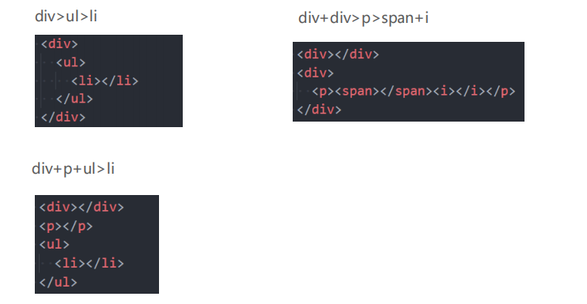


### 3、（多个）和^（上一级）

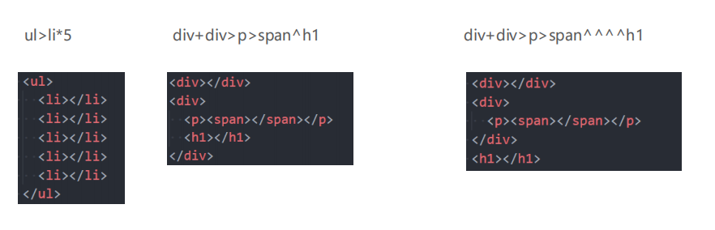

```html
<!DOCTYPE html>
<html lang="en">
<head>
  <meta charset="UTF-8">
  <meta http-equiv="X-UA-Compatible" content="IE=edge">
  <meta name="viewport" content="width=device-width, initial-scale=1.0">
  <title>Document</title>
</head>
<body>
  <!-- ul>li*10  -->
  <ul>
    <li></li>
    <li></li>
    <li></li>
    <li></li>
    <li></li>
    <li></li>
    <li></li>
    <li></li>
    <li></li>
    <li></li>
  </ul>

  <!-- div>span+p+(h1>span+i)+p  -->
  <!-- div>span+p+h1>span+i^p  -->
  <!-- ^表示上一级 -->
  <div>
    <span></span>
    <p></p>
    <h1>
      <span></span>
      <i></i>
    </h1>
    <p></p>
  </div>

  <!-- div>span+p+h1>span+i^^p -->
  <!-- ^^表示上两级 -->
  <!-- ^^^^很多个最终只能到body  -->
  <div>
    <span></span>
    <p></p>
    <h1>
      <span></span>
      <i></i>
    </h1>
  </div>
  <p></p>

</body>
</html>
```


### 4、()（分组）

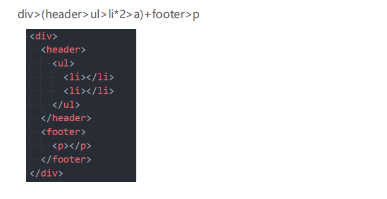

```html
<!DOCTYPE html>
<html lang="en">
<head>
  <meta charset="UTF-8">
  <meta http-equiv="X-UA-Compatible" content="IE=edge">
  <meta name="viewport" content="width=device-width, initial-scale=1.0">
  <title>Document</title>
</head>
<body>
  <!-- (header>div>p+span)+footer  -->
  <header>
    <div>
      <p></p>
      <span></span>
    </div>
  </header>
  <footer></footer>
</body>
</html>
```


## 二、常见Emmet语法

### 1、属性(id属性、class属性、普通属性) {}（内容）

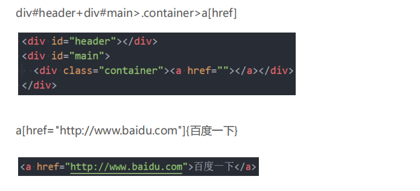

```html
<!DOCTYPE html>
<html lang="en">
<head>
  <meta charset="UTF-8">
  <meta http-equiv="X-UA-Compatible" content="IE=edge">
  <meta name="viewport" content="width=device-width, initial-scale=1.0">
  <title>Document</title>
</head>
<body>
  <!-- a[href="http://www.baidu.com"]{百度一下} -->
  <a href="http://www.baidu.com">百度一下</a>

  <!-- ul>li{列表内容}*10 -->
  <ul>
    <li>列表内容</li>
    <li>列表内容</li>
    <li>列表内容</li>
    <li>列表内容</li>
    <li>列表内容</li>
    <li>列表内容</li>
    <li>列表内容</li>
    <li>列表内容</li>
    <li>列表内容</li>
    <li>列表内容</li>
  </ul>

  <!-- id/class  -->
  <!-- #main  -->
  <div id="main"></div>
  
  <!-- .main  -->
  <div class="main"></div>

  <!-- ul>li{列表序号$}*10  -->
  <ul>
    <li>列表序号1</li>
    <li>列表序号2</li>
    <li>列表序号3</li>
    <li>列表序号4</li>
    <li>列表序号5</li>
    <li>列表序号6</li>
    <li>列表序号7</li>
    <li>列表序号8</li>
    <li>列表序号9</li>
    <li>列表序号10</li>
  </ul>

  <!-- ul>li{列表序号$$$}*10  -->
  <ul>
    <li>列表序号001</li>
    <li>列表序号002</li>
    <li>列表序号003</li>
    <li>列表序号004</li>
    <li>列表序号005</li>
    <li>列表序号006</li>
    <li>列表序号007</li>
    <li>列表序号008</li>
    <li>列表序号009</li>
    <li>列表序号010</li>
  </ul> 
</body>
</html>
```


### 2、$（数字）

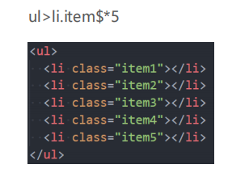


### 3、隐式标签

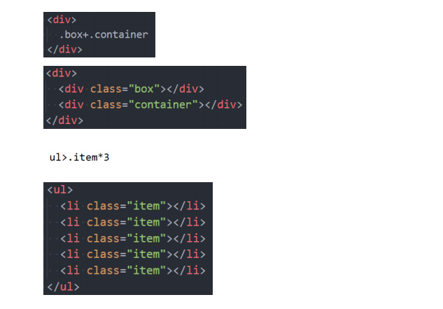

```html
<!DOCTYPE html>
<html lang="en">
<head>
  <meta charset="UTF-8">
  <meta http-equiv="X-UA-Compatible" content="IE=edge">
  <meta name="viewport" content="width=device-width, initial-scale=1.0">
  <title>Document</title>
  <style>
    div {
      /* bd  */
      border: 1px solid #000;
      /* bd#cs  */
      border: #ccc solid;
    }
  </style>
</head>
<body>
  <!-- 一般默认都是div -->
  <div class="box"> </div>
  <div id="main"></div>

  <!-- ul>.item{列表元素$}*5 -->
  <ul>
    <li class="item">列表元素1</li>
    <li class="item">列表元素2</li>
    <li class="item">列表元素3</li>
    <li class="item">列表元素4</li>
    <li class="item">列表元素5</li>
  </ul>


</body>
</html>
```


### 4、CSS Emmet

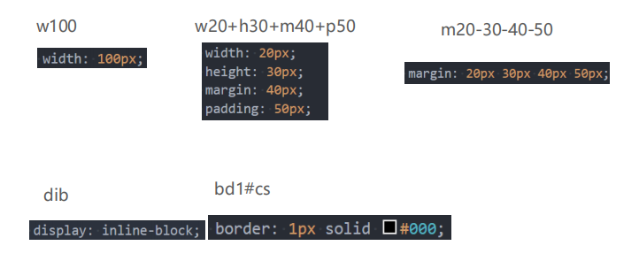


## 三、常见的结构伪类

### 1、结构伪类 - :nth-child

* :nth-child(1)
	* 是父元素中的第1个子元素

* :nth-child(2n)
	* n代表任意正整数和0
	* 是父元素中的第偶数个子元素（第2、4、6、8......个）
	* 跟:nth-child(even)同义

* :nth-child(2n + 1)
	* n代表任意正整数和0
	* 是父元素中的第奇数个子元素（第1、3、5、7......个）
	* 跟:nth-child(odd)同义

* nth-child(-n + 2)
	* 代表前2个子元素

```html
<!DOCTYPE html>
<html lang="en">
<head>
  <meta charset="UTF-8">
  <meta http-equiv="X-UA-Compatible" content="IE=edge">
  <meta name="viewport" content="width=device-width, initial-scale=1.0">
  <title>Document</title>
  <style>
    /* ul li { */
    ul > li:nth-child(1) {
      color: red;
    }
    ul li:nth-of-type(3) {
      color: red;
    }
    /*0, 1, 2, ...*/
    ul li:nth-child(2n) {
      color: blue;
    }

    ul li:nth-child(2n+1){
      color: green;
    }

    div > div:nth-child(4n+1) {
      color: orange;
    }

    div > div:nth-child(4n+2) {
      color: purple;
    }
    div > div:nth-child(4n+3) {
      color: red;
    }

    /* div > div:nth-child(4n) {  */
    div > div:nth-child(4n+4) {
      color: green;
    }

    /* 选择前5个 */
    div > div:nth-child(-n+5) {
      font-size: 20px;
    }

  </style>
</head>
<body>

  <ul>
    <li>列表元素1</li>
    <li>列表元素2</li>
    <!-- nth-child(3)不能选择span -->
    <span>1234ajkdfa</span>  
    <li>列表元素3</li>
    <li>列表元素4</li>
    <li>列表元素5</li>
    <li>列表元素6</li>
  </ul>


  <div>
    <div>列表元素1</div>
    <div>列表元素2</div>
    <div>列表元素3</div>
    <div>列表元素4</div>
    <div>列表元素5</div>
    <div>列表元素6</div>
    <div>列表元素7</div>
    <div>列表元素8</div>
    <div>列表元素9</div>
    <div>列表元素10</div>
    <div>列表元素11</div>
    <div>列表元素12</div>
    <div>列表元素13</div>
    <div>列表元素14</div>
    <div>列表元素15</div>
    <div>列表元素16</div>
    <div>列表元素17</div>
    <div>列表元素18</div>
    <div>列表元素19</div>
    <div>列表元素20</div>
  </div>

</body>
</html>
```

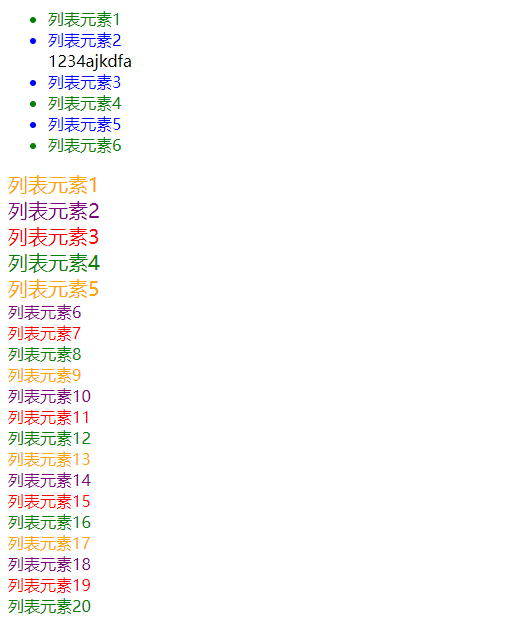


### 2、结构伪类 - :nth-last-child( )

* :nth-last-child()的语法跟:nth-child()类似，不同点是:nth-last-child()从最后一个子元素开始往前计数
	*  :nth-last-child(1)，代表倒数第一个子元素
	* :nth-last-child(-n + 2)，代表最后2个子元素

* nth-of-type()用法跟:nth-child()类似
	* 不同点是:nth-of-type()计数时只计算同种类型的元素

* :nth-last-of-type()用法跟:nth-of-type()类似
	* 不同点是:nth-last-of-type()从最后一个这种类型的子元素开始往前计数

```html
<!DOCTYPE html>
<html lang="en">
<head>
  <meta charset="UTF-8">
  <meta http-equiv="X-UA-Compatible" content="IE=edge">
  <meta name="viewport" content="width=device-width, initial-scale=1.0">
  <title>Document</title>
  <style>

    /* 倒数的某一个时 */
    ul li:nth-last-child(2) {
      color: red;
    }

    /* 倒数的后几个时 */
    ul li:nth-last-child(-n+3) {
      font-size: 20px;
    }
  </style>
</head>
<body>

  <ul>
    <li>列表元素1</li>
    <li>列表元素2</li>
    <li>列表元素3</li>
    <li>列表元素4</li>
    <li>列表元素5</li>
    <li>列表元素6</li>
    <li>列表元素7</li>
    <li>列表元素8</li>
  </ul>

</body>
</html>
```

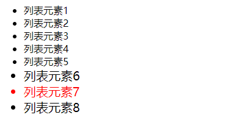


### 3、结构伪类 - :nth-of-type( )、:nth-last-of-type( )

* 其他常见的伪类(了解):
	* :first-child，等同于:nth-child(1)
	* :last-child，等同于:nth-last-child(1)
	* :first-of-type，等同于:nth-of-type(1)
	* :last-of-type，等同于:nth-last-of-type(1)
	* :only-child，是父元素中唯一的子元素
	* :only-of-type，是父元素中唯一的这种类型的子元素

* 下面的伪类偶尔会使用:
	* :root，根元素，就是HTML元素
	* :empty代表里面完全空白的元素

```html
<!DOCTYPE html>
<html lang="en">
<head>
  <meta charset="UTF-8">
  <meta http-equiv="X-UA-Compatible" content="IE=edge">
  <meta name="viewport" content="width=device-width, initial-scale=1.0">
  <title>Document</title>
  <style>
    /* 需求，选择box中第三个div元素,并且是第三个子元素 */
    .box > div:nth-child(3) {
      color: red;
    }

    /* 需求：选择box中的第三个div元素（排除所有的干扰项） */
    /* 元素: nth-of-type,只计算符合我元素类型的数量的元素 */
    .box > div:nth-of-type(3) {
      color: blue;
    }

  </style>
</head>
<body>
  
  <div class="box">
    <div>我是列表1</div>
    <p>我是p元素</p>
    <span>我是span1</span>
    <span>我是span2</span>
    <span>我是span3</span>
    <span>我是span4</span>
    <div>我是列表2</div>
    <div>我是列表3</div>
    <div>我是列表4</div>
    <div>我是列表5</div>
    <div>我是列表6</div>
    <div>我是列表7</div>
    <div>我是列表8</div>
    <div>我是列表9</div>
    <div>我是列表10</div>
  </div>

</body>
</html>
```

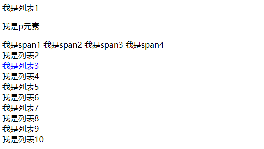


```html
<!DOCTYPE html>
<html lang="en">
<head>
  <meta charset="UTF-8">
  <meta http-equiv="X-UA-Compatible" content="IE=edge">
  <meta name="viewport" content="width=device-width, initial-scale=1.0">
  <title>Document</title>
  <style>
    .box> div:first-child {
      color: red;
    }
    /* .box > :first-child {
      color: orange;
    } */
    
    /* 唯一子元素 */
    .box > :only-child {
      font-size: 20px;
      font-weight: 700;
    }

    .box > :only-of-type {
      color: purple;
    }

    /* html 元素*/
    :root {
      font-size: 30px;
    }

    /*元素为空则生效*/
    :empty {
      width: 100px;
      height: 100px;
      background-color: red;
    }
  </style>
</head>
<body>

  <div class="box">
    <!-- <span>我是span元素</span> -->
    <div>列表内容1</div>
    <div>列表内容2</div>
    <div>列表内容3</div>
    <div>列表内容4</div>
    <div>列表内容5</div>
  </div>

  <div class="box">
    <div>我是box的div</div>
    <span>我是span元素</span>
  </div>

  <div class="box">
    <div>我是box的div</div>
    <div>我是box的div</div>
  </div>

  <div class="container"></div>
</body>
</html>
```

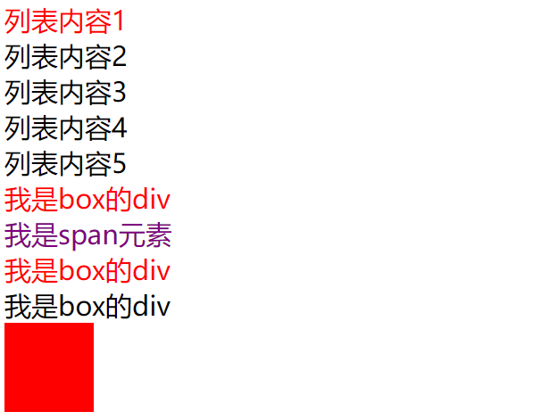


## 四、否定伪类的使用

### 否定伪类（negation pseudo-class）

* :not()的格式是:not(x)
	* x是一个简单选择器
	* 元素选择器、通用选择器、属性选择器、类选择器、id选择器、伪类（除否定伪类）

* :not(x)表示除x以外的元素

```html
<!DOCTYPE html>
<html lang="en">
<head>
  <meta charset="UTF-8">
  <meta http-equiv="X-UA-Compatible" content="IE=edge">
  <meta name="viewport" content="width=device-width, initial-scale=1.0">
  <title>Document</title>
  <style>
    .item {
      color: red;
    }

    .box :not(.zky) {
      color: blue;
    }
  </style>
</head>
<body>
  
  <div class="box">
    <div class="item">列表内容1</div>
    <div class="item">列表内容2</div>
    <div class="zky">列表内容3</div>
    <div class="item">列表内容4</div>
    <div class="item">列表内容5</div>
    <div>列表内容6</div>
    <div>列表内容7</div>
    <div>列表内容8</div>
  </div>

</body>
</html>
```

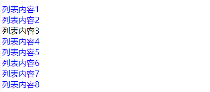

