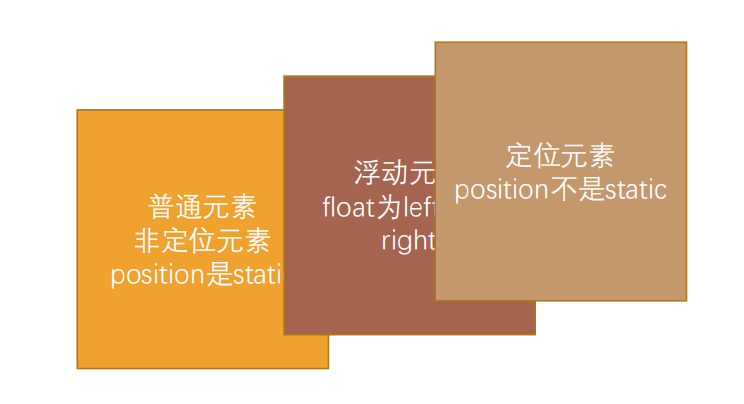
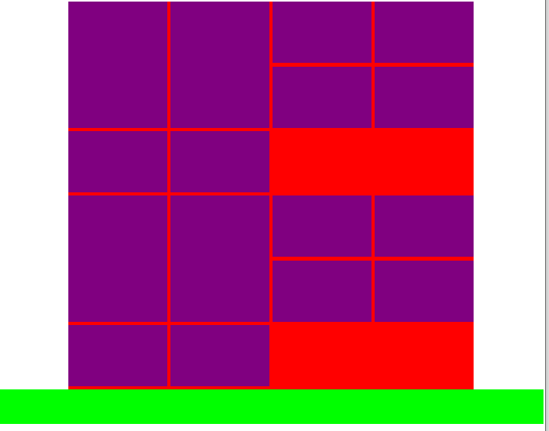

# 布局-元素的浮动

## 一、认识浮动

* float 属性可以指定一个元素应沿其容器的左侧或右侧放置，允许文本和内联元素环绕它。
	* float 属性最初只用于在一段文本内浮动图像, 实现文字环绕的效果;
	* 但是早期的CSS标准中并没有提供好的左右布局方案, 因此在一段时间里面它成为网页多列布局的最常用工具;

* 绝对定位、浮动都会让元素脱离标准流，以达到灵活布局的效果

* 可以通过float属性让元素产生浮动效果，float的常用取值
	* none：不浮动，默认值
	* left：向左浮动
	* right：向右浮动


## 二、浮动的规则

### 1、浮动规则一

* 元素一旦浮动后, 脱离标准流
	* 朝着向左或向右方向移动，直到自己的边界紧贴着包含块（一般是父元素）或者其他浮动元素的边界为止
	* 定位元素会层叠在浮动元素上面



### 2、浮动规则二

* 如果元素是向左（右）浮动，浮动元素的左（右）边界不能超出包含块的左（右）边界


```html
<!DOCTYPE html>
<html lang="en">
<head>
  <meta charset="UTF-8">
  <meta http-equiv="X-UA-Compatible" content="IE=edge">
  <meta name="viewport" content="width=device-width, initial-scale=1.0">
  <title>Document</title>
  <style>

    body {
      margin: 0;
      overflow: 0;
    }

    .box {
      width: 200px;
      height: 200px;
      background-color: orange;
      margin: 0 auto;
      padding: 10px;
    }

    .item1, .item2 {
      background-color: #f00;
    }

    .item1 {
      /* 定位脱离标准流 */
      /* position: fixed;
      left: 0;
      top: 10px;
      background-color: #0f0; */

       /* 脱离标准流 */
      float: left;
      background-color: #0f0;
    }

    .item2 {
      float: right;
    }
  </style>
</head>
<body>

  <div class="box">
    <div class="item1">1</div>
    <div class="item2">2</div>
  </div>

</body>
</html>
```


### 3、浮动规则三

* 规则: 浮动元素之间不能层叠
	* 如果一个元素浮动，另一个浮动元素已经在那个位置了，后浮动的元素将紧贴着前一个浮动元素（左浮找左浮，右浮找右浮）
	* 如果水平方向剩余的空间不够显示浮动元素，浮动元素将向下移动，直到有充足的空间为止


```html
<!DOCTYPE html>
<html lang="en">
<head>
  <meta charset="UTF-8">
  <meta http-equiv="X-UA-Compatible" content="IE=edge">
  <meta name="viewport" content="width=device-width, initial-scale=1.0">
  <title>Document</title>
  <style>
    .box {
      width: 1000px;
      height: 400px;
      background-color: orange;
    }

    /*脱离标准流，和行内级元素不能层叠，行内级元素会被推出*/
    .box strong {
      float: left;
    }
  </style>
</head>
<body>

  <div class="box">
    <span>我是span元素</span>
    <strong>我是strong元素</strong>
    <i>我是i元素</i>
    <div>我是普通元素的内容</div>
  </div>

</body>
</html>
```


### 4、浮动规则四

* 浮动元素不能与行内级内容层叠，行内级内容将会被浮动元素推出
	* 比如行内级元素、inline-block元素、块级元素的文字内容


```html
<!DOCTYPE html>
<html lang="en">
<head>
  <meta charset="UTF-8">
  <meta http-equiv="X-UA-Compatible" content="IE=edge">
  <meta name="viewport" content="width=device-width, initial-scale=1.0">
  <title>Document</title>
  <style>
    .box {
      width: 500px;
      background: orange;
    }

    .box img {
      width: 300px;
      float: left;
    }

  </style>
</head>
<body>
  
  <div class="box">
    
    入门GPT首先说第一个问题：如何入门GPT模型？最直接的方式当然是去阅读官方的论文。
    GPT模型从2018年的GPT-1到现在的GPT-4已经迭代了好几个版本，通过官方团队发表的论文是最能准确理清其发展脉络的途径，其中包括GPT模型本身和一些介绍关键技术的文章，比如训练方法RLHF这些。下面列出一些主要的文章。
    作者：卜寒兮
    链接：https://www.zhihu.com/question/599713780/answer/3055040756
    来源：知乎
    著作权归作者所有。商业转载请联系作者获得授权，非商业转载请注明出处。
  </div>

</body>
</html>
```


### 5、浮动规则五

* 规则五: 行内级元素、inline-block元素浮动后，其顶部将与所在行的顶部对齐


## 三、浮动的案例

### 知识点：空隙的解决方案

* 将多个行内级元素中间的空格（间隙）去除的方法
	* 1.删除换行符(不推荐)
	* 2.将父级元素(.box)的font-size 设置为0，但是需要子元素(span)设置回来
	* 3.通过子元素(span)统一向一个方向浮动即可
	* 4.flex 布局

```html
<!DOCTYPE html>
<html lang="en">
<head>
  <meta charset="UTF-8">
  <meta http-equiv="X-UA-Compatible" content="IE=edge">
  <meta name="viewport" content="width=device-width, initial-scale=1.0">
  <title>Document</title>
  <style>
    .box {
      /*方法2：*/
      /* font-size: 0; */

      /* 方法4 */
      display: flex;
    }

    span {
      background-color: orange;
      /*方法2：*/
      /*.box的font-size设置为了0，需要重新设置*/
      /* font-size: 16px; */

      /*方法3：浮动会紧挨着*/
      /* float: left; */

      /* 如果需要空隙可以通过margin设置 */
      /* margin-right: 5px; */
    }
  </style>

</head>
<body>

  <!--
    将多个行内级元素中间的空格（间隙）去除的方法
    1.删除换行符(不推荐)
    2.将父级元素(.box)的font-size 设置为0，但是需要子元素(span)设置回来
    3.通过子元素(span)统一向一个方向浮动即可
    4.flex 布局
  -->

  <div class="box">
    <!-- 浏览器将换行解析为空格 -->
    <!-- 方法1 -->
    <!-- <span>aaa</span><span>bbb</span><span>ccc</span> -->

    <span>aaa</span>
    <span>bbb</span>
    <span>ccc</span>
  </div>

</body>
</html>
```


### 1、浮动练习一（百度页码展示）

* 浮动常用的场景
	* 解决行内级元素、inline-block元素的水平间隙问题


```html
<!DOCTYPE html>
<html lang="en">
<head>
  <meta charset="UTF-8">
  <meta http-equiv="X-UA-Compatible" content="IE=edge">
  <meta name="viewport" content="width=device-width, initial-scale=1.0">
  <title>Document</title>
  <style>
    /* 样式的重置 */
    ul, li {
      list-style: none;
      padding: 0;
      margin: 0;
    }

    a {
      text-decoration: none;
      color: #333;
    }

    /* 全局设置 */
    body {
      background-color: #f2f2f2;
    }

    /* 内容样式 */
    ul > li {
      float: left;
      margin-left: 12px;
      
    }
    
    ul > li > a {
      display: inline-block;
      width: 36px;
      height: 36px;
      text-align: center;
      line-height: 36px;
      border-radius: 6px;
      background-color: #fff;
      color: #3951b3;
      font-size: 14px;
    }

    ul > li > a:hover, ul > li.active > a {
      background-color: #4e6ef2;
      color: #fff;
    }

    /* ul > li.active > a {
      background-color: #4e6ef2;
      color: #fff;
    } */

    ul > li.next > a {
      width: 80px;
    }

  </style>

</head>
<body>
  
  <!-- 结构：HTML -->
  <ul>
    <li class="item"><a href="#">1</a></li>
    <li class="item"><a href="#">2</a></li>
    <li class="item"><a href="#">3</a></li>
    <li class="item"><a href="#">4</a></li>
    <li class="item"><a href="#">5</a></li>
    <li class="item"><a href="#">6</a></li>
    <li class="item active"><a href="#">7</a></li>
    <li class="item"><a href="#">8</a></li>
    <li class="item"><a href="#">9</a></li>
    <li class="item"><a href="#">10</a></li>
    <li class="item next"><a href="#">下一页 &gt;</a></li>
  </ul>

</body>
</html>
```


### 2、浮动练习二（京东多列布局）

* 浮动布局方案:
	* 实现京东页面下面的布局


```html
<!DOCTYPE html>
<html lang="en">
<head>
  <meta charset="UTF-8">
  <meta http-equiv="X-UA-Compatible" content="IE=edge">
  <meta name="viewport" content="width=device-width, initial-scale=1.0">
  <title>Document</title>
  <style>
    /* 公共的class */
    .content {
      width: 1190px;
      margin: 0 auto;
      background-color: orange;
      height: 800px;
      color: #fff;
    }

    /* 布局样式 */

    /* 解决占一行的问题 */
    /* 方法4： */
    /* 
      1190
      box ->div ->width(auto) ->1190
      父级盒子的宽度 = 子盒子宽度 + margin-right + margin-left
      1190 = 1190 + 0(ml) + (mr)
      将mr = -10
      1190 = 1190 + 0 - 10不相等的,因为width是auto，所以修改为
      1190 = 1200 + 0 - 10

      -->box==1200 = (230+10)*5
    */
    .box {
      margin-right: -10px;

      /* 下面.item 的margin:0 5px */
      /* margin: 0 -5px; */
    }

    .item {
      width: 230px;
      height: 322px;
      background-color: purple;

      /* 浮动 */
      float: left;
      margin-right: 10px;

      /* margin: 0 5px; */
    }

    /* 方法1： */
    /* .item:last-child {
      margin-right: 0;
    } */

    /* 方法2： */
    /* 新的选择器，可能兼容性存在一定问题 */
    /* .item:nth-child(5n) {
      margin-right: 0;
    } */

    /* 方法3： */
    /* 添加 last-item ，麻烦一点*/
    /* .item.last-item {
      margin-right: 0;
    } */

    /* 方法4：元素包裹一个box的class*/

  </style>
</head>
<body>

  <div class="content">
    <div class="box">
      <div class="item item1">1</div>
      <div class="item item2">2</div>
      <div class="item item3">3</div>
      <div class="item item4">4</div>
      <!-- 方法3：添加 -->
      <!-- <div class="item item5 last-item">5</div> -->
      <div class="item item5">5</div>
      <div class="item item1">1</div>
      <div class="item item2">2</div>
      <div class="item item3">3</div>
      <div class="item item4">4</div>
      <!-- <div class="item item5 last-item">5</div> -->
      <div class="item item5">5</div>
    </div>
  </div>

</body>
</html>
```


### 3、浮动练习三（京东多列布局）

* 浮动布局方案:
	* 实现京东页面下面的布局


```html
<!DOCTYPE html>
<html lang="en">
<head>
  <meta charset="UTF-8">
  <meta http-equiv="X-UA-Compatible" content="IE=edge">
  <meta name="viewport" content="width=device-width, initial-scale=1.0">
  <title>Document</title>
  <style>
    .content {
      width: 1190px;
      margin: 0 auto;
      background-color: #f00;
      height: 1000px;
    }

    .wrapper {
      margin-right: -10px;
    }

    .item {
      width: 290px;
      background-color: purple;
      margin-bottom: 10px;

      float: left;
      margin-right: 10px;
    }

    .item.left {
      height: 370px;
    }

    .item.right {
      height: 180px;
    }
  </style>
</head>
<body>
  
  <div class="content">
    <!-- 
      增加wrapper夫级层次
      设置margin-right: -10px; 
    -->
    <div class="wrapper">
      <div class="item left"></div>
      <div class="item left"></div>
      <div class="item right"></div>
      <div class="item right"></div>
      <div class="item right"></div>
      <div class="item right"></div>
    </div>
  </div>

</body>
</html>
```


### 4、浮动练习四（重点理解-目前不常见）

* 浮动布局方案:
	* 实现考拉页面下面的布局


方案1：

```html
<!DOCTYPE html>
<html lang="en">
<head>
  <meta charset="UTF-8">
  <meta http-equiv="X-UA-Compatible" content="IE=edge">
  <meta name="viewport" content="width=device-width, initial-scale=1.0">
  <title>Document</title>
  <style>
    .content {
      width: 1100px;
      height: 800px;
      margin: 0 auto;
      background-color: orange;
    }

    .box {
      border: 1px solid #000;
      height: 168px;
      /* border设置为1px，两边就是总共占据了2px */
      margin-right: -2px;
      border-right: none;
    }

    .item {
      width: 220px;
      height: 168px;

      float: left;

      border-right: 1px solid #000;
      box-sizing: border-box;
    }
  </style>
</head>
<body>
  <!-- 
    1、方案1
      先整个div设置：border 1px
      后设置 item：
        .item {
          border-right : 1px
        }
    2、方案2 
        设置所有的item border 1px
        将最后一个item项设置: border-right: none
    3、方案3
        所有的item都有border
        没有border-right:none
   -->
   <div class="content">
    <div class="box">
      <div class="item">1</div>
      <div class="item">2</div>
      <div class="item">3</div>
      <div class="item">4</div>
      <div class="item">5</div>
    </div>
   </div>
</body>
</html>
```


方案3：

设置负值(让strong左移)

```html
<!DOCTYPE html>
<html lang="en">
<head>
  <meta charset="UTF-8">
  <meta http-equiv="X-UA-Compatible" content="IE=edge">
  <meta name="viewport" content="width=device-width, initial-scale=1.0">
  <title>Document</title>
  <style>
    span, strong {
      float: left;
    }
    span {
      background-color: #f00;
    }

    strong {
      background-color: #0f0;
      margin-left: -10px;
    }
  </style>
</head>
<body>

  <span>我是span元素</span>
  <strong>我是strong元素</strong>

</body>
</html>
```


```html
<!DOCTYPE html>
<html lang="en">
<head>
  <meta charset="UTF-8">
  <meta http-equiv="X-UA-Compatible" content="IE=edge">
  <meta name="viewport" content="width=device-width, initial-scale=1.0">
  <title>Document</title>
  <style>
    .content {
      width: 1100px;
      height: 800px;
      margin: 0 auto;
      background: #ccc;
    }

    .box {
      /* 整体左移 */
      /* margin-left: 1px; */
    }


    .item {
      /* width: 220px; */
      /* 
      margin-left: -1px;
      所以最后右边有一个空位
      解决：将width=221px
      */
      width: 221px;
      height: 168px;
      background: orange;
      color: #fff;

      float: left;

      border: 1px solid #000;
      /* 设置负值来设置solid */
      /* margin-left: -1px; */
      margin-right: -1px;

      box-sizing: border-box;
    }

    .item.first {
      width: 220px;
    }
  </style>
</head>
<body>
  <!-- 
    1、方案1
      先整个div设置：border 1px
      后设置 item：
        .item {
          border-right : 1px
        }
    2、方案2 
        设置所有的item border 1px
        将最后一个item项设置: border-right: none
    3、方案3
        所有的item都有border
        没有border-right:none
   -->
   <div class="content">
    <div class="box">
      <div class="item">1</div>
      <div class="item">2</div>
      <div class="item">3</div>
      <div class="item">4</div>
      <div class="item">5</div>
    </div>
   </div>
</body>
</html>
```


## 四、清除的问题

### 1、浮动的问题 – 高度塌陷

* 由于浮动元素脱离了标准流，变成了脱标元素，所以不再向父元素汇报高度
	* 父元素计算总高度时，就不会计算浮动子元素的高度，导致了高度坍塌的问题
* 解决父元素高度坍塌问题的过程，一般叫做清浮动（清理浮动、清除浮动）
* 清浮动的目的是
	* 让父元素计算总高度的时候，把浮动子元素的高度算进去
* 如何清除浮动呢? 使用clear属性


### 2、CSS属性 - clear

* clear属性是做什么的呢?
	* clear 属性可以指定一个元素是否必须移动(清除浮动后)到在它之前的浮动元素下面;

* clear的常用取值
	* left：要求元素的顶部低于之前生成的所有左浮动元素的底部
	* right：要求元素的顶部低于之前生成的所有右浮动元素的底部
	* both：要求元素的顶部低于之前生成的所有浮动元素的底部
	* none：默认值，无特殊要求

* 那么我们可以利用这个特性来清除浮动


## 五、清除浮动-清除浮动的方法

事实上我们有很多方法可以清除浮动

### 1、方法一: 给父元素设置固定高度

​	扩展性不好（不推荐）


### 2、方法二: 在父元素最后增加一个空的块级子元素，并且让它设置clear: both

* 会增加很多无意义的空标签，维护麻烦
* 违反了结构与样式分离的原则（不推荐）


### 3、方法三: 伪元素清除浮动

* 推荐;
* 编写好后可以轻松实现清除浮动;
* 给父元素添加一个伪元素
	* 给父元素增加 ::after 伪元素
	* 纯CSS样式解决，结构与样式分离（推荐）


```html
<!DOCTYPE html>
<html lang="en">
<head>
  <meta charset="UTF-8">
  <meta http-equiv="X-UA-Compatible" content="IE=edge">
  <meta name="viewport" content="width=device-width, initial-scale=1.0">
  <title>Document</title>
  <style>
    .content {
      width: 1190px;
      height: 370+180+10 px;
      margin: 0 auto;
      background-color: #f00;
      /* height: 1000px; */
    }

    .wrapper {
      margin-right: -10px;
    }
  
    .item {
      width: 290px;
      background-color: purple;
      margin-bottom: 10px;

      float: left;
      margin-right: 10px;
    }

    .item.left {
      height: 370px;
    }

    .item.right {
      height: 180px;
    }

    /* 其他的内容 */
     .other {
      height: 100px;
      background: #0f0; 
     }

     .line {
      /* height: 10px; */
      /* background: blue; */
      clear: both;
     }

     /* 最终的解决方案 */
     .clear_fix::after {
       content: "";
       clear: both;
       display: block;

       /* 浏览器兼容 */
       visibility: hidden; 
       height: 0;
     }

     .clear_fix {
      *zoom: 1;  /* 兼容IE6、7 */
     }
  </style>
</head>
<body>
  
  <!-- 因为所有的后代item元素都是浮动的，脱离标准流 -->
  <!-- 不会向父元素汇报高度，那么content 元素压根就没有高度 -->
  <div class="content">
    <!-- 
      增加wrapper夫级层次
      设置margin-right: -10px; 
    -->
    <div class="wrapper clear_fix">
      <div class="item left"></div>
      <div class="item left"></div>
      <div class="item right"></div>
      <div class="item right"></div>
      <div class="item right"></div>
      <div class="item right"></div>
      <div class="item right"></div>
      <div class="item right"></div>

      <!-- <div class="line"></div> -->
    </div>
  </div>

  <div class="content">
    <div class="wrapper clear_fix">
      <div class="item left"></div>
      <div class="item left"></div>
      <div class="item right"></div>
      <div class="item right"></div>
      <div class="item right"></div>
      <div class="item right"></div>
      <div class="item right"></div>
      <div class="item right"></div>

      <!-- <div class="line"></div> -->
    </div>
  </div>


  <!-- 我认为content没有高度，那么我们就会直接在上面显示 -->
  <div class="other">

  </div>

</body>
</html>
```



## 六、布局方案对比


  