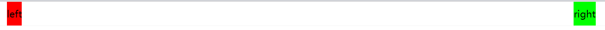

# 代码规范+组件化开发思想

## 一、代码规范

### 1、代码规范

* 遵守上课的代码规范
* 参考凹凸实验室代码规范：
	https://guide.aotu.io/
* https://codeguide.co/


## 二、CSS编写顺序

CSS编写顺序


### 1.先确定盒子本身是如何布局

* position: absolute

* float: left/right

* display: flex

### 2.盒子的特性和可见性
* display: block/inline-block/inline/none

* visibility/opacity

### 3.盒子模型

* width/height

* box-sizing

* margin/border/padding/content

* box-shadow/text-shadow

### 4.内部的文本文字

* font/text

### 5.background

  background-image/size/position/color

### 6.其他

  transform/transition/overflow/white-space

## 三、组件化开发思想

事实上目前Vue、React、小程序都采用的是组件化开发思路


项目整体思路 – 各个击破


## 四、项目实战

### 1、开发中遇到问题总结


Q：left 和 right是默认撑满整个高度height的

A：align-items: normal默认情况下不写，则就是streach


```css
.top .area {
      display: flex;
      justify-content: space-between;
      /* align-items: normal; */
      /* align-items: stretch; */
      height: 100px;
}
```

Q: height == line-height: 41px;

A: 可以使得left 和 right 垂直居中





Q: 名称的下划线不一样

A：

公共类里面：用的 X_Y

内部区域自己的：用的 X-Y 


Q: 让logo和recommend同一行显示


```css
.left-area {
      display: flex;
      background-color: #f00;
    }
```


A：为left-area添加flex布局


Q: 怎么把腾讯游戏几个字去除，换为图片


```css
.top .left-area .logo a {
      display: block;
      width: 150px;
      height: 100%; /*继承父类的*/
      text-indent: -9999px; /* 隐藏 腾讯游戏 这几个字显示图片 */
      background: url(./img/top_logo.png) no-repeat center center;
    }
```


A: 设置text-indent: -9999px; 


Q；img行内替换元素，可能下面会存在一下小像素

```css
/* img的vertical-align重置 */
img {
  vertical-align: top;
}
```

A：reset.css 中 重置img的vertical-align


Q：精灵图设置之后没有对齐


A：给 i  元素的 父亲 a 设置(子绝父相) ， 以及设置 margin 等


